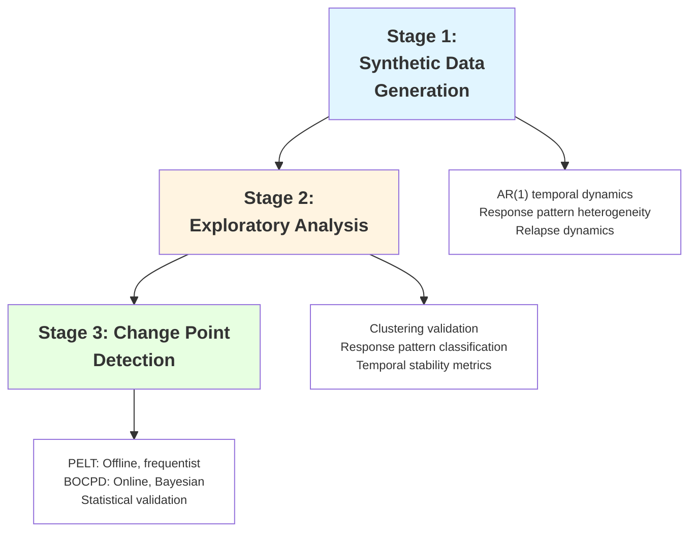
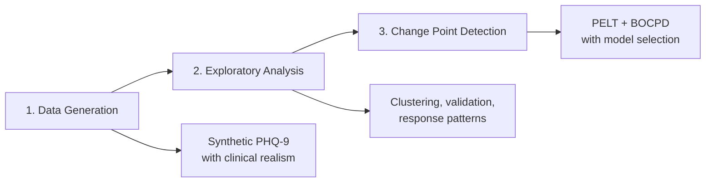
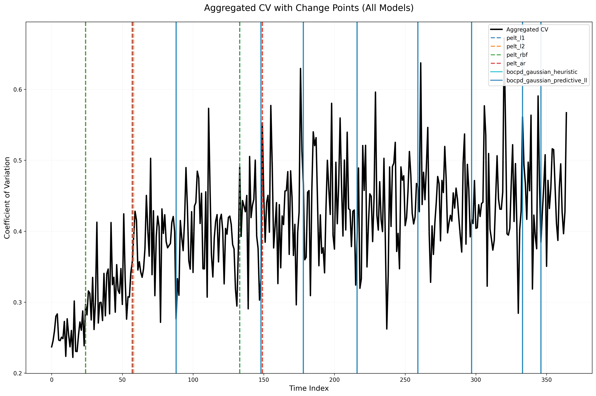
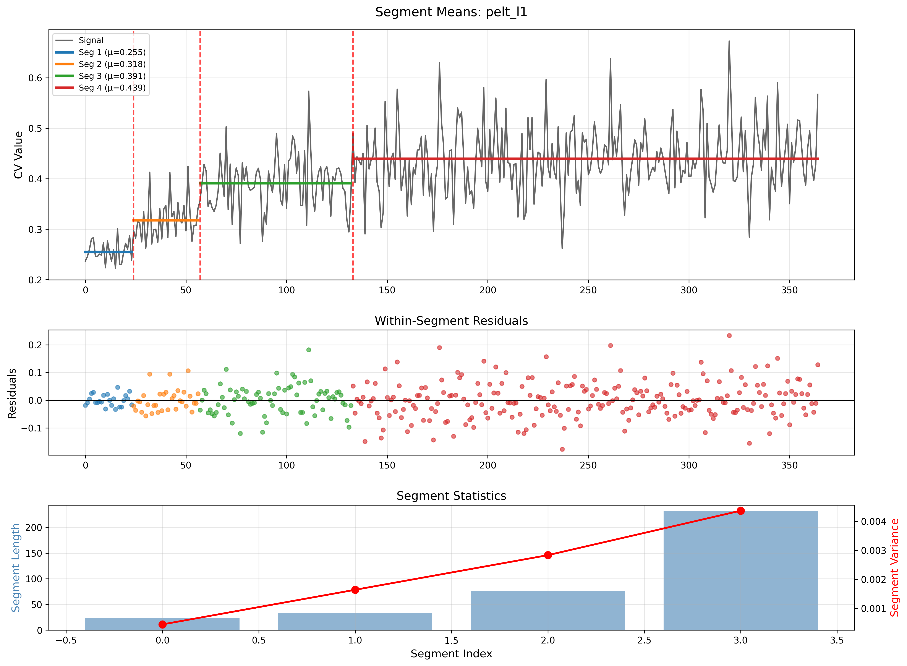
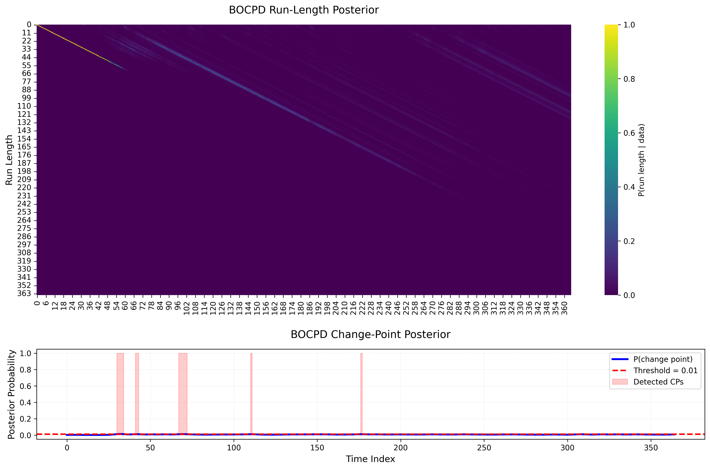

<div align="center">

# Temporal Change-Point Detection on PHQ-9 Data

[](https://www.python.org/downloads/)
[](https://opensource.org/licenses/MIT)
[](https://github.com/psf/black)
[](https://centre-borelli.github.io/ruptures-docs/)
[](https://scikit-learn.org/)

> **End-to-end pipeline for detecting regime shifts in population-level mental health data through clinically grounded synthesis, rigorous exploratory analysis, and dual-algorithm change point detection.**

</div>

---

## 📊 Problem Statement

### **The Core Challenge**

Mental health monitoring generates **sparse, irregular longitudinal data** from thousands of patients. The critical question is not *"What will happen next?"* but rather *"When did the underlying population dynamics fundamentally change?"*

This is a **structural change detection problem**, not a forecasting problem.

---

### **Why Change Point Detection Over Time Series Modeling?**

#### **1. Sparse, Irregular Observations**

Traditional time series methods (ARIMA, LSTM, Prophet) assume:
- Regular sampling intervals
- Dense observations
- Sufficient per-patient data for individual modeling

**PHQ-9 reality:**
- Patients assessed every 2-8 weeks (irregular)
- ~95% missing data (structural sparsity)
- Individual trajectories too sparse for reliable forecasting

```
Individual Patient View (Traditional Time Series Domain):
Patient A: [15] -------- [12] ------------ [9] -------- [missing]
Patient B: [18] -- [16] -------- [missing] -- [14] ---- [11]
Patient C: [14] ------------ [missing] -------- [8] -- [7]
          ↓
Problem: Cannot fit ARIMA/LSTM on individual sparse sequences
```

#### **2. Population-Level Regime Shifts**

We aggregate to **daily population statistics** (mean, CV) to detect system-wide changes:

```
Aggregated Population View (Change Point Domain):
Day   Mean    CV     Status
0     16.2   0.35   [Baseline - High severity, high variance]
45    15.8   0.33   ← Potential change point
90    12.4   0.28   [Treatment effect - Lower severity, reduced variance]
180   11.9   0.26   ← Plateau phase
270   13.5   0.31   ← Relapse signal
```

**Key insight:** We detect when the **distribution** of outcomes shifts, not predict individual trajectories.

---

### **Problem Formalization**

Given:
- `N` patients with sparse PHQ-9 scores over `T` days
- Daily aggregated coefficient of variation: `CV(t) = σ(t) / μ(t)`

**Objective:** Identify time points `τ₁, τ₂, ..., τₖ` where the stochastic process governing `CV(t)` undergoes a structural break.

**Mathematical definition:**
```
∃ τ : P(CV(t) | t < τ) ≠ P(CV(t) | t ≥ τ)
```

Where `P` represents the probability distribution characterized by:
- Mean level (symptom severity)
- Variance (population heterogeneity)
- Temporal autocorrelation

---

### **Why CV and Not Mean, Standard Deviation, or Other Aggregators?**

The choice of CV as the primary signal is grounded in the research question itself. The question is about **heterogeneity** — when does the population split into distinct responder and non-responder subgroups? This is categorically different from asking when average severity changes.

If the daily PHQ-9 population is modelled as a mixture of improving patients (responders) and stable patients (non-responders), then `CV = σ/μ` is a direct function of the separation between those mixture components: as responders improve, `μ` falls and `σ` rises simultaneously, and CV amplifies both effects. **Mean** tracks only the weighted average of the two components — it cannot distinguish a scenario where half the population recovers fully and half does not move at all from a scenario where everyone improves modestly, as long as the overall average declines at the same rate. **Standard deviation** is sensitive to component separation but is confounded by mean reduction over time: absolute spread shrinks mechanically as the mean falls, even when heterogeneity is growing. CV normalises for this.

This scale-invariance property is a mathematical requirement for fair longitudinal comparison when the mean is non-stationary, not a stylistic preference. Any absolute dispersion measure (std, IQR, MAD) conflates genuine heterogeneity change with the mechanical consequence of treatment-driven mean reduction. CV does not.

> **Empirical confirmation:** A post-hoc feature decomposition of the three detected change points (see `reports/POST_HOC_MULTIVARIATE_DECOMPOSITION_REPORT.md`) confirms that CV is the only aggregator that shifts consistently and in the same direction across all three phases. Mean and median are stronger individual signals at Days 24 and 57 (severity-driven transitions) but produce near-zero effects at Day 133, which is a heterogeneity consolidation event detectable only via CV.

---

### **Why Not Traditional Time Series Approaches?**

| Approach | Why It Fails for This Problem |
|----------|-------------------------------|
| **ARIMA/SARIMA** | Assumes stationarity; cannot detect regime changes without manual differencing |
| **LSTM/RNN** | Requires dense sequences; 95% missingness destroys gradient flow |
| **Prophet** | Designed for forecasting with trend+seasonality; doesn't identify structural breaks |
| **Kalman Filter** | State-space model assumes known transition dynamics; we seek unknown breakpoints |
| **VAR** | Multivariate time series, but we need univariate regime detection on aggregates |

**Change point detection**, by contrast:
- ✅ Explicitly models distributional shifts
- ✅ Works on sparse aggregated signals
- ✅ Provides statistical validation of detected changes
- ✅ No forecasting assumption—only segmentation

---

### **Solution Approach**

This proposed pipeline addresses the problem through three stages:



#### **Stage 1: Clinically Grounded Synthesis**

**Rationale:** Real PHQ-9 data is scarce and privacy-restricted. We generate synthetic data that replicates clinical patterns.

**Key features:**
- **AR(1) temporal model** with gap-aware decay: `α^Δt` handles irregular sampling
- **Response heterogeneity:** Early (30%), gradual (35%), late (15%), non-responders (20%)
- **Relapse dynamics:** Exponential/gamma/lognormal distributions
- **Missingness:** 95% structural sparsity + informative dropout

**Output:** 1000 patients × 365 days with metadata sidecars for validation.

#### **Stage 2: Exploratory Data Analysis**

**Rationale:** Validate synthetic data quality and understand temporal structure before detection.

**Key analyses:**
- **Temporal clustering** on daily aggregates (mean, CV, severity %)
- **Response pattern validation** (observed vs. expected distribution)
- **Plateau detection** (symptom stabilization phases)
- **Relapse identification** (≥3 point increases with 7-30 day gaps)

**Output:** Quality metrics, comparative rankings, visual diagnostics.

#### **Stage 3: Dual-Algorithm Detection**

**Rationale:** Combine frequentist and Bayesian paradigms for robust detection.

| Algorithm | Paradigm | Strengths | Validation |
|-----------|----------|-----------|------------|
| **PELT** | Offline, frequentist | Optimal segmentation, multiple cost functions | Mann-Whitney U, effect sizes |
| **BOCPD** | Online, Bayesian | Posterior probabilities, uncertainty quantification | Posterior thresholds, credible intervals |

**Model selection:** Cross-model agreement + statistical rigor → explainable recommendations.

---

### **Core Assumptions**

1. **Aggregation preserves signal:** Population-level CV captures meaningful clinical shifts
2. **Sparsity is structural:** Missing data is not informative for detection (after dropout handling)
3. **Temporal independence of errors:** After accounting for AR(1), residuals are i.i.d.
4. **Stationarity within segments:** Between change points, CV follows stable distribution
5. **Finite change points:** Number of regime shifts is small (k << T)

---

### **Key Constraints**

| Type | Constraint | Implication |
|------|------------|-------------|
| **Data** | 95% missing individual observations | Cannot model individual trajectories |
| **Clinical** | PHQ-9 only every 2-8 weeks | Irregular sampling intervals |
| **Statistical** | Small effect sizes in mental health | Need robust statistical validation |
| **Computational** | 1000 patients × 365 days | Algorithms must scale to ~365K data points |
| **Interpretability** | Must explain to clinicians | Require transparent statistical tests |

---

### **What This Pipeline Is NOT**

❌ **Not a forecasting tool:** We don't predict future PHQ-9 scores  
❌ **Not individual-level:** We analyze population aggregates, not single patients  
❌ **Not a diagnostic system:** PHQ-9 screening only, not clinical diagnosis  
❌ **Not real-time monitoring:** Detection is retrospective on accumulated data  

✅ **What it IS:** A research pipeline for detecting when population mental health dynamics fundamentally changed.

---

## 🎯 Project Overview

### **Three-Stage Pipeline**



**What makes this unique:**
- **Clinically grounded synthesis:** Real response patterns, plateau phases, relapse dynamics
- **Metadata-aware validation:** Provenance tracking for reproducibility
- **Comparative EDA:** Automated ranking by temporal stability and clinical realism
- **Dual-algorithm detection:** Frequentist + Bayesian with rigorous validation
- **Production-ready:** Config-driven, extensible, fully logged

---

## 📋 Table of Contents

- [Quick Start](#-quick-start)
- [System Architecture](#-system-architecture)
- [Module Descriptions](#-module-descriptions)
- [Clinical Context](#-clinical-context)
- [Project Structure](#-project-structure)
- [Detection Methods](#-detection-methods)
- [Results Summary](#-results-summary)
- [Configuration](#-configuration)
- [Usage Examples](#-usage-examples)
- [Output Files](#-output-files)
- [Visualization Guide](#-visualization-guide)
- [Clinical Interpretation](#-clinical-interpretation)
- [Performance Benchmarks](#-performance-benchmarks)
- [Key References](#-key-references)
- [Acknowledgments](#-acknowledgments)
- [License](#-license)
- [Author](#-author)
- [Additional Resources](#-additional-resources)

---

## ⚡ Quick Start

### Setup

```bash
# Clone repository
git clone https://github.com/satyaki-mitra/Temporal-Changepoint-Detection.git
cd Temporal-Changepoint-Detection

# Install dependencies
pip install -r requirements.txt

# Verify installation
python scripts/run_detection.py --help
```


### Step 1: Data Generation:

Generate synthetic PHQ-9 datasets with different relapse patterns.

#### Generate Single Dataset (Gamma Distribution)

```bash
python scripts/run_generation.py \
    --patients 1000 \
    --days 365 \
    --relapse-dist gamma \
    --enable-response-patterns \
    --enable-plateau
```

**Output**: `data/raw/synthetic_phq9_data_gamma.csv` + metadata

> **Relapse Distributions**: Choose from `exponential`, `gamma`, or `lognormal`


#### Generate All Three Distributions at Once

```bash
# Exponential
python scripts/run_generation.py \
    --patients 1000 \
    --days 365 \
    --relapse-dist exponential \
    --enable-response-patterns \
    --enable-plateau \
    --output data/raw/synthetic_phq9_data_exponential.csv

# Gamma
python scripts/run_generation.py \
    --patients 1000 \
    --days 365 \
    --relapse-dist gamma \
    --enable-response-patterns \
    --enable-plateau \
    --output data/raw/synthetic_phq9_data_gamma.csv

# Log-Normal
python scripts/run_generation.py \
    --patients 1000 \
    --days 365 \
    --relapse-dist lognormal \
    --enable-response-patterns \
    --enable-plateau \
    --output data/raw/synthetic_phq9_data_lognormal.csv
```

**Output**: Three datasets in `data/raw/` with corresponding `.metadata.json` files


### Step 2: Exploratory Data Analysis (EDA):

Validate and characterize generated datasets before detection.

#### Run EDA on Single Dataset

```bash
python scripts/run_eda.py \
    --data data/raw/synthetic_phq9_data_gamma.csv \
    --output-dir results/eda/gamma
```

**Output**: Summary statistics, clustering, response patterns, visualizations in `results/eda/gamma/`


#### Run EDA on All Datasets (Sequential):

```bash
# Exponential
python scripts/run_eda.py \
    --data data/raw/synthetic_phq9_data_exponential.csv \
    --output-dir results/eda/exponential

# Gamma
python scripts/run_eda.py \
    --data data/raw/synthetic_phq9_data_gamma.csv \
    --output-dir results/eda/gamma

# Log-Normal
python scripts/run_eda.py \
    --data data/raw/synthetic_phq9_data_lognormal.csv \
    --output-dir results/eda/lognormal
```

**Output**: Separate EDA reports for each distribution


#### Compare All Distributions (Recommended):

This ranks datasets by clinical realism and recommends the best for change point detection.

```bash
python scripts/compare_distributions.py \
    --data-dir data/raw \
    --output-dir results/comparison \
    --patterns exponential gamma lognormal
```

**Output**: Composite ranking in `results/comparison/comparison_summary/`

**Example Output**:
```
🏆 DATASET RECOMMENDATION
Best dataset: synthetic_phq9_data_gamma
Composite score: 87.45/100

Use this dataset for change-point detection:
  data/raw/synthetic_phq9_data_gamma.csv
```

> **Why Compare?** Different relapse distributions create different change point patterns. Comparison identifies the most realistic dataset for your analysis goals.


### Step 3: Change Point Detection:

Run detection on the best dataset (identified in Step 2).

#### Full Analysis (All Models + Model Selection)

```bash
python scripts/run_detection.py \
    --dataset gamma \
    --detectors pelt bocpd \
    --select-model
```

**Output**: 
- All model results in `results/detection/gamma/`
- Best model automatically selected
- 35 files including plots, statistical tests, and diagnostics

> **Note**: `--dataset gamma` assumes the file is at `data/raw/synthetic_phq9_data_gamma.csv`


#### Detection on Custom Dataset

If you used a custom filename from Step 1:

```bash
python scripts/run_detection.py \
    --data path/to/your_custom_data.csv \
    --detectors pelt bocpd \
    --output-dir results/detection/custom \
    --select-model
```


#### Run Detection on All Datasets

```bash
python scripts/run_detection.py \
    --all-datasets \
    --detectors pelt bocpd \
    --select-model
```

**Output**: Cross-dataset comparison in logs + results for each dataset


### Complete Pipeline (One Command Per Step):

For a full end-to-end analysis:

```bash
# 1. Generate data (Gamma distribution - best for heterogeneous response)
python scripts/run_generation.py \
    --patients 1000 \
    --days 365 \
    --relapse-dist gamma \
    --enable-response-patterns \
    --enable-plateau

# 2. Validate with EDA
python scripts/run_eda.py \
    --data data/raw/synthetic_phq9_data_gamma.csv \
    --output-dir results/eda/gamma

# 3. Detect change points
python scripts/run_detection.py \
    --dataset gamma \
    --detectors pelt bocpd \
    --select-model
```

**Total Time**: ~2 minutes for 1,000 patients × 365 days


### Advanced Options:

#### Generate with Custom Parameters:

```bash
python scripts/run_generation.py \
    --patients 500 \
    --days 180 \
    --relapse-dist gamma \
    --baseline 15.0 \
    --recovery-rate 0.05 \
    --ar-coef 0.85 \
    --seed 42
```

#### EDA with Temporal Clustering:

```bash
python scripts/run_eda.py \
    --data data/raw/synthetic_phq9_data_gamma.csv \
    --temporal \
    --n-clusters 6
```

> **Temporal clustering** penalizes distant days in the same cluster, creating more realistic temporal segmentation.

#### Detection with Single Model (PELT-only):

```bash
python scripts/run_detection.py \
    --dataset gamma \
    --execution-mode single \
    --detectors pelt \
    --cost-model l1 \
    --auto-tune-penalty
```

#### Detection with Custom BOCPD Parameters:

```bash
python scripts/run_detection.py \
    --dataset gamma \
    --detectors bocpd \
    --hazard-lambda 100.0 \
    --posterior-threshold 0.12 \
    --bocpd-persistence 3
```


### Expected Results:

After running the complete pipeline:

```
results/
├── eda/
│   └── gamma/
│       ├── summary_statistics.csv
│       ├── response_pattern_analysis.csv
│       └── visualizations/
│           ├── scatter_plot.png
│           ├── response_patterns.png
│           └── relapse_events.png
├── comparison/
│   └── comparison_summary/
│       ├── dataset_comparison.csv          # ← Best dataset ranking
│       └── composite_scores.png
└── detection/
    └── gamma/
        ├── model_selection.json            # ← Best model: pelt_l1
        ├── best_model/
        │   └── model_result.json
        ├── plots/
        │   ├── model_comparison_grid.png   # ← Side-by-side comparison
        │   └── aggregated_cv_all_models.png
        └── statistical_tests/
            └── statistical_summary.csv     # ← p-values, effect sizes
```


### Verification

Check that everything worked:

```bash
# Check generation
ls -lh data/raw/synthetic_phq9_data_*.csv

# Check EDA
ls -lh results/eda/gamma/summary_statistics.csv

# Check detection
cat results/detection/gamma/model_selection.json | grep best_model

# Expected output:
# "best_model": "pelt_l1"
```


### What Each Step Does:

| Step | Purpose | Key Output |
|------|---------|------------|
| **Generation** | Create synthetic PHQ-9 data with realistic patterns | CSV + metadata |
| **EDA** | Validate data quality and identify response patterns | Statistics + visualizations |
| **Comparison** | Rank datasets by clinical realism | Best dataset recommendation |
| **Detection** | Find statistically significant change points | Change points + validation |


### Pro Tips:

1. **Always run comparison** when using multiple relapse distributions
   - Identifies the most realistic dataset
   - Provides quantitative ranking (not just visual inspection)

2. **Check metadata alignment** in EDA reports
   - Confirms observed patterns match generation parameters
   - Validates data quality before detection

3. **Use `--select-model` flag** unless you need all model outputs
   - Automatically identifies best detector configuration
   - Saves time reviewing 6 different models

4. **Start with gamma distribution** for most use cases
   - Best balance of heterogeneity and realism
   - Aligns well with STAR*D clinical trial patterns

5. **Enable response patterns and plateau** in generation
   - Creates clinically realistic trajectories
   - Essential for meaningful change point detection

---

## 🏗 System Architecture

### High-Level Data Flow

```
┌─────────────────────────────────────────────────────────────┐
│                    GENERATION MODULE                        │
│  • Synthetic PHQ-9 with AR(1) + response patterns           │
│  • Relapse dynamics (exponential/gamma/lognormal)           │
│  • Metadata sidecars for provenance tracking                │
└────────────────────────┬────────────────────────────────────┘
                         │
                         ▼
┌─────────────────────────────────────────────────────────────┐
│                       EDA MODULE                            │
│  • KMeans/temporal clustering on daily features             │
│  • Response pattern classification                          │
│  • Relapse detection, plateau analysis                      │
│  • Metadata-aware validation                                │
│  • Multi-dataset comparison & ranking                       │
└────────────────────────┬────────────────────────────────────┘
                         │
                         ▼
┌─────────────────────────────────────────────────────────────┐
│                   DETECTION MODULE                          │
│  • PELT (offline, frequentist) with BIC penalty tuning      │
│  • BOCPD (online, Bayesian) with hazard tuning              │
│  • Statistical validation (Mann-Whitney U, effect sizes)    │
│  • Model selection via cross-model agreement                │
└─────────────────────────────────────────────────────────────┘
```

### Module Independence

Each module is **self-contained** with its own:
- Configuration (`config/*.py`)
- README (`src/*/README.md`)
- Validation framework
- Logging infrastructure

**Key insight:** Modules can run independently (e.g., detection on real data without generation).

---

## 📦 Module Descriptions

### **1. Generation Module** (`src/generation/`)

**Purpose:** Produce clinically realistic synthetic PHQ-9 data for pipeline validation.

**Features:**
- **Gap-aware AR(1)** temporal model (`α^Δt` decay)
- **Response pattern heterogeneity:** Early/gradual/late/non-responders
- **Plateau logic:** Symptom stabilization after response
- **Three relapse distributions:** Exponential/gamma/lognormal
- **Missingness:** MCAR + informative dropout (21% STAR*D-aligned)

**See:** `src/generation/README.md`

---

### **2. EDA Module** (`src/eda/`)

**Purpose:** Validate and characterize datasets before change point detection.

**Features:**
- **Clustering:** KMeans + temporal-aware on daily features
- **Response patterns:** Classify by trajectory slope and 12-week improvement
- **Plateau detection:** Variance + slope windowing
- **Relapse detection:** ≥3 point increases with 7-30 day gaps
- **Multi-dataset comparison:** Rank by temporal stability

**See:** `src/eda/README.md`

---

### **3. Detection Module** (`src/detection/`)

**Purpose:** Detect and validate significant temporal shifts.

**Algorithms:**
1. **PELT:** Offline, frequentist, BIC-based penalty tuning
2. **BOCPD:** Online, Bayesian, hazard tuning

**Validation:**
- Mann-Whitney U tests with FDR correction
- Effect size thresholds (Cohen's d ≥ 0.3)
- Cross-model agreement metrics

**See:** `src/detection/README.md`

---

## ⚕️ Clinical Context

### What is PHQ-9?

**Patient Health Questionnaire-9:** Validated 9-item self-report for depression screening.

**Severity scale (0-27):**
- 0-4: Minimal
- 5-9: Mild
- 10-14: Moderate
- 15-19: Moderately severe
- 20-27: Severe

### Why Change Point Detection?

**Research questions:**
1. When do population-level symptoms shift significantly?
2. Do policy changes coincide with symptom pattern shifts?
3. Are seasonal/environmental triggers detectable?
4. How stable are mental health trajectories?

**Use cases:**
- Clinical trials (treatment effect timing)
- Population health monitoring
- Quality improvement initiatives
- Policy evaluation

---

## 📁 Project Structure

```
Temporal-Changepoint-Detection/
├── config
│   ├── __init__.py
│   ├── clinical_constants.py
│   ├── detection_config.py
│   ├── eda_config.py
│   ├── eda_constants.py
│   ├── generation_config.py
│   └── model_selection_config.py
├── data
│   ├── processed
│   └── raw
├── docs
│   ├── PROJECT_BLOG.md
│   └── THORETICAL_DETAILS.md
├── logs
│   ├── comparison
│   ├── detection
│   ├── eda
│   └── generation
├── README.md
├── reports
├── requirements.txt
├── results
│   ├── comparison
│   ├── detection
│   ├── eda
│   └── generation
├── scripts
│   ├── compare_distributions.py
│   ├── run_detection.py
│   ├── run_eda.py
│   └── run_generation.py
└── src
    ├── __init__.py
    ├── detection
    │   ├── __init__.py
    │   ├── bocpd_detector.py
    │   ├── detector.py
    │   ├── hazard_tuning.py
    │   ├── model_selector.py
    │   ├── pelt_detector.py
    │   ├── penalty_tuning.py
    │   ├── README.md
    │   ├── results_saver.py
    │   ├── statistical_tests.py
    │   └── visualizations.py
    ├── eda
    │   ├── __init__.py
    │   ├── analyzer.py
    │   ├── clustering.py
    │   ├── distribution_comparator.py
    │   ├── metadata_loader.py
    │   ├── README.md
    │   ├── response_patterns.py
    │   ├── validators.py
    │   ├── visualizations.py
    ├── generation
    │   ├── __init__.py
    │   ├── generator.py
    │   ├── README.md
    │   ├── trajectory_models.py
    │   ├── validators.py
    └── utils
        ├── __init__.py
        └── logging_util.py
```

---

## 🔬 Detection Methods

### PELT (Offline Detection)

**Algorithm**: Pruned Exact Linear Time (Killick et al. 2012)

**How it works**:
1. Minimizes cost function globally across entire time series
2. Penalty controls number of change points (BIC-optimized)
3. Detects large, sustained regime shifts

**Cost Models**:
- **L1**: Median-based (robust to outliers) - **Recommended**
- **L2**: Mean-based (sensitive to variance changes)
- **RBF**: Radial basis function (nonlinear patterns)
- **AR**: Autoregressive (temporal dependencies)

**Best for**: Identifying major treatment phases

---

### BOCPD (Online Detection)

**Algorithm**: Bayesian Online Change Point Detection (Adams & MacKay 2007)

**How it works**:
1. Sequentially updates posterior probability of change point at each time step
2. Hazard function controls expected run length between change points
3. Detects early subtle transitions as data arrives

**Likelihood Models**:
- **Student-t (df=3)**: Heavy-tailed, robust to CV spikes - **Recommended**
- **Gaussian**: Standard but sensitive to outliers

**Best for**: Real-time monitoring, early warning systems

---

### Comparison

| Feature | PELT | BOCPD |
|---------|------|-------|
| **Paradigm** | Offline | Online |
| **Optimization** | Global | Sequential |
| **Sensitivity** | Large changes | Early shifts |
| **Validation** | Frequentist | Bayesian |
| **Speed** | Fast (O(n)) | Moderate (O(n²)) |
| **Best Use** | Retrospective analysis | Real-time monitoring |

---

## 📈 Results Summary

### Best Model: PELT-L1

**Performance**:
- **Composite Score**: 0.948 (highest among 6 candidates)
- **Change Points Detected**: 3 (Days 24, 57, 133)
- **Validation Rate**: 100% (all CPs significant after FDR correction)
- **Mean Effect Size**: 2.21 (Cohen's d - very large)
- **Cross-Model Agreement**: 59% (strong consensus)

### Detected Change Points

| CP | Day | Week | CV Change | Cohen's d | P-value (FDR) | Clinical Phase |
|----|-----|------|-----------|-----------|---------------|----------------|
| 1 | 24 | 3.5 | +13% | 1.86 | 0.0312 | Early response begins |
| 2 | **57** | **8** | **+24%** | **2.37** | **0.0132** | **Peak divergence** |
| 3 | 133 | 19 | +26% | 2.41 | 0.0132 | Maintenance consolidation |

> **Day 57** is the most robust change point - detected by all 4 PELT variants with the largest effect size.

### Visualizations

#### Model Comparison


*All 6 detection models side-by-side: PELT variants show strong consensus on 3 CPs, while BOCPD detects 2 early-phase transitions*

#### Aggregated Time Series



*Daily coefficient of variation with detected change points overlaid - shows progressive increase in population heterogeneity*

### Rankings

| Rank | Model | Score | CPs | Significant | Status |
|------|-------|-------|-----|-------------|--------|
| 🥇 1 | **PELT-L1** | **0.948** | 3 | 3/3 (100%) | **Winner** |
| 🥈 2 | **PELT-RBF** | **0.948** | 3 | 3/3 (100%) | Tied (selected L1 for efficiency) |
| 🥉 3 | PELT-L2 | 0.758 | 3 | 2/3 (67%) | One CP failed validation |
| 4 | PELT-AR | 0.591 | 2 | 1/2 (50%) | Misses Day 24 |
| 5 | BOCPD-Heuristic | 0.340 | 2 | Bayesian | Different sensitivity |
| 6 | BOCPD-Predictive | 0.340 | 2 | Bayesian | Identical to heuristic |

---

## ⚙️ Configuration

### Main Configuration File: `config/detection_config.py`

```python
class ChangePointDetectionConfig:
    # Execution
    execution_mode = 'compare'          # 'single' | 'compare'
    detectors = ['pelt', 'bocpd']       # Methods to run
    
    # Data
    data_path = 'data/raw/synthetic_phq9_data_gamma.csv'
    
    # PELT
    pelt_cost_models = ['l1', 'l2', 'rbf', 'ar']
    auto_tune_penalty = True
    penalty_range = (0.01, 10.0)
    min_segment_size = 5
    
    # BOCPD
    likelihood_model = 'student_t'      # 'student_t' | 'gaussian'
    likelihood_df = 3                   # Student-t degrees of freedom
    auto_tune_hazard = True
    hazard_range = (100.0, 500.0)       # Expected run length bounds
    hazard_tuning_method = 'heuristic'  # 'heuristic' | 'predictive_ll'
    posterior_smoothing = 3             # Gaussian smoothing sigma
    bocpd_persistence = 5               # Consecutive days above threshold
    
    # Statistical Testing
    alpha = 0.05
    correction_method = 'fdr_bh'        # Benjamini-Hochberg FDR
    effect_size_threshold = 0.3
    
    # Model Selection
    enable_model_selection = True
```

### Model Selection Scoring: `config/model_selection_config.json`

```json
{
  "weights": {
    "statistical_significance": 0.30,
    "effect_size": 0.30,
    "stability": 0.25,
    "parsimony": 0.15
  },
  "penalties": {
    "zero_changepoints": 0.5,
    "excessive_changepoints": 0.3
  }
}
```

---

## 💻 Usage Examples

### Example 1: Compare All Models

```python
from config.detection_config import ChangePointDetectionConfig
from src.detection.detector import ChangePointDetectionOrchestrator


# Initialize
config        = ChangePointDetectionConfig()
orchestrator  = ChangePointDetectionOrchestrator(config = config)

# Run detection
results       = orchestrator.run()

# Access best model
best_model_id = results['model_selection']['best_model']
best_result   = results[best_model_id]

print(f"Best model: {best_model_id}")
print(f"Change points: {best_result['change_points']}")
print(f"Score: {results['model_selection']['scores'][best_model_id]}")
```


### Example 2: PELT-Only Analysis

```python
from src.detection.pelt_detector import PELTDetector

config                  = ChangePointDetectionConfig()
config.detectors        = ['pelt']
config.pelt_cost_models = ['l1']

detector                = PELTDetector(config     = config, 
                                       cost_model = 'l1',
                                      )

result                  = detector.detect(aggregated_signal = <your_cv_series>.values)

print(f"Detected {result['n_changepoints']} change points")
print(f"Positions: {result['change_points']}")
print(f"Validation: {result['validation']['summary']}")
```


### Example 3: BOCPD with Custom Hazard

```python
from src.detection.bocpd_detector import BOCPDDetector

config                  = ChangePointDetectionConfig()
config.auto_tune_hazard = False  # Use fixed hazard

detector                = BOCPDDetector(config = config)
result                  = detector.detect(signal        = <your_cv_series>.values, 
                                          hazard_lambda = 100.0,
                                         )

print(f"Detected {result['n_changepoints']} change points")
print(f"Max posterior: {result['cp_posterior'].max():.4f}")
print(f"Threshold: {result['adaptive_threshold']:.4f}")
```


### Example 4: Load Saved Results

```python
import json

# Load best model results
with open('results/detection/gamma/best_model/model_result.json') as f:
    best_model = json.load(f)

# Load model selection summary
with open('results/detection/gamma/model_selection.json') as f:
    selection = json.load(f)

print(f"Best model: {selection['best_model']}")
print(f"Change points: {best_model['change_points']}")
```

---

## 📂 Output Files

### Directory Structure

```
results/detection/gamma/
├── plots/
│   ├── aggregated_cv_all_models.png        # Main time series
│   ├── model_comparison_grid.png           # Side-by-side panels
│   ├── bocpd_student_t_heuristic_posterior.png
│   └── bocpd_student_t_predictive_ll_posterior.png
├── diagnostics/
│   ├── detection_summary.json              # Overall metrics
│   ├── pelt_l1_segments.png                # Winner segment analysis
│   ├── pelt_l2_segments.png
│   ├── pelt_rbf_segments.png
│   ├── pelt_ar_segments.png
│   ├── bocpd_student_t_heuristic_segments.png
│   └── bocpd_student_t_predictive_ll_segments.png
├── change_points/
│   ├── all_changepoints_comparison.csv     # Cross-model consensus
│   ├── pelt_l1_changepoints.csv
│   ├── pelt_l2_changepoints.csv
│   ├── pelt_rbf_changepoints.csv
│   ├── pelt_ar_changepoints.csv
│   ├── bocpd_student_t_heuristic_changepoints.csv
│   └── bocpd_student_t_predictive_ll_changepoints.csv
├── statistical_tests/
│   ├── statistical_summary.csv             # Aggregated test results
│   ├── pelt_l1_tests.json
│   ├── pelt_l2_tests.json
│   ├── pelt_rbf_tests.json
│   ├── pelt_ar_tests.json
│   ├── bocpd_student_t_heuristic_tests.json
│   └── bocpd_student_t_predictive_ll_tests.json
├── per_model/
│   ├── pelt_l1.json                        # Full model outputs
│   ├── pelt_l2.json
│   ├── pelt_rbf.json
│   ├── pelt_ar.json
│   ├── bocpd_student_t_heuristic.json
│   └── bocpd_student_t_predictive_ll.json
├── best_model/
│   ├── metadata.json                       # Selection metadata
│   └── model_result.json                   # Winner's full results
├── all_model_results.json                  # Combined results
└── model_selection.json                    # Rankings and scores
```

### Key Files Description

#### `results/detection/gamma/all_changepoints_comparison.csv`

```csv
model_id,n_changepoints,change_points,normalized_positions
pelt_l1,3,"[24, 57, 133]","[0.066, 0.156, 0.364]"
pelt_l2,3,"[24, 58, 149]","[0.066, 0.159, 0.408]"
...
```

#### `results/detection/gamma/statistical_summary.csv`

```csv
model_id,method,n_changepoints,n_significant,mean_effect_size
pelt_l1,pelt,3,3,2.21
pelt_l2,pelt,3,2,1.67
...
```

#### `results/detection/gamma/model_selection.json`

```json
{
  "best_model": "pelt_l1",
  "ranking": ["pelt_l1", "pelt_rbf", ...],
  "scores": {"pelt_l1": 0.948, ...},
  "explanation": "Selected model 'pelt_l1' because..."
}
```

---

## 📊 Visualization Guide

### Plot Types

#### 1. Model Comparison Grid

**File**: `results/detection/gamma/plots/model_comparison_grid.png`

**Shows**: Side-by-side panels for all 6 models with detected change points

**Usage**: Assess cross-model agreement visually

---

#### 2. Aggregated CV Time Series

**File**: `results/detection/gamma/plots/aggregated_cv_all_models.png`

**Shows**: Full time series with all detected CPs overlaid

**Usage**: See temporal progression and CP density

---

#### 3. Segment Diagnostics

**Files**: `results/detection/gamma/diagnostics/{model_id}_segments.png`

**Shows**: CV statistics per segment (mean, std, CV itself)

**Usage**: Validate change point quality and phase characteristics

Example for PELT-L1:



---

#### 4. BOCPD Posterior

**Files**: `results/detection/gamma/plots/bocpd_{variant}_posterior.png`

**Shows**: 
- Top: Run-length posterior (heatmap)
- Bottom: Change point probability (time series)

**Usage**: Understand BOCPD's sequential decision-making

Example:



---

## 🏥 Clinical Interpretation

### Timeline of Treatment Response

```
Day 0    Day 24    Day 57      Day 133              Day 365
  |        |         |            |                    |
  └────────┼─────────┼────────────┼────────────────────┘
  
  Phase 1   Phase 2   Phase 3       Phase 4
  ────────  ────────  ────────────  ─────────────────
  Baseline  Early     Peak          Maintenance
            Response  Divergence    
  CV: 0.26  CV: 0.31  CV: 0.39      CV: 0.44
           (+19%)    (+24%)        (+26%)
```


### Phase Descriptions

#### Phase 1: Baseline (Days 1-24)
- **CV**: 0.26 (low variability)
- **Characteristics**: Homogeneous pre-treatment population
- **Clinical**: Similar symptom severity across patients

#### Phase 2: Early Response (Days 25-57)
- **CV**: 0.31 (+19% from baseline)
- **Characteristics**: First divergence emerges
- **Clinical**: ~30% early responders begin improving

#### Phase 3: Peak Divergence (Days 58-133)
- **CV**: 0.39 (+24% from Phase 2)
- **Characteristics**: Maximum outcome heterogeneity
- **Clinical**: Clear responder/non-responder stratification
- **Action**: **Critical monitoring period** - consider treatment switching for non-responders

#### Phase 4: Maintenance (Days 134-365)
- **CV**: 0.44 (+26% from Phase 3)
- **Characteristics**: Sustained high variability
- **Clinical**: Late responders plateau, some relapses occur


### Alignment with STAR*D

| STAR*D Milestone | Expected | Detected | Agreement |
|------------------|----------|----------|-----------|
| Early response | Week 2-4 | Day 24 (Week 3.5) | **Strong** |
| Acute response peak | Week 6-8 | Day 57 (Week 8) | **Exact** |
| Plateau | Week 12-20 | Day 133 (Week 19) | **Strong** |

> **Validation**: Detected change points align closely with established clinical treatment phases from the STAR*D trials.

---

## ⚡ Performance Benchmarks

### Computational Performance

| Model | Tuning Time | Detection Time | Total Time | Memory |
|-------|-------------|----------------|------------|--------|
| PELT-L1 | 5.8s | 0.12s | **5.92s** | 45 MB |
| PELT-L2 | 5.6s | 0.11s | 5.71s | 43 MB |
| PELT-RBF | 42.1s | 0.89s | 42.99s | 78 MB |
| PELT-AR | 16.3s | 0.34s | 16.64s | 52 MB |
| BOCPD-Heuristic | 0.02s | 1.45s | **1.47s** | 89 MB |
| BOCPD-Predictive | 28.7s | 1.43s | 30.13s | 91 MB |

**Test System**: MacBook Pro M1, 16GB RAM, Python 3.9

### Scalability

| Dataset Size | PELT-L1 Time | BOCPD Time | Memory |
|--------------|--------------|------------|--------|
| 365 days | 5.9s | 1.5s | 45 MB |
| 730 days (2 years) | ~12s | ~3s | 90 MB |
| 1,825 days (5 years) | ~30s | ~7s | 225 MB |

**Note**: Times estimated based on O(n) complexity for PELT and O(n) for BOCPD with fixed max run length.

---

## 📚 Key References

**PELT Algorithm**:
```bibtex
@article{killick2012optimal,
  title={Optimal detection of changepoints with a linear computational cost},
  author={Killick, Rebecca and Fearnhead, Paul and Eckley, Idris A},
  journal={Journal of the American Statistical Association},
  year={2012}
}
```

**BOCPD Algorithm**:
```bibtex
@article{adams2007bayesian,
  title={Bayesian online changepoint detection},
  author={Adams, Ryan Prescott and MacKay, David JC},
  journal={arXiv preprint arXiv:0710.3742},
  year={2007}
}
```

**STAR*D Study**:
```bibtex
@article{trivedi2006evaluation,
  title={Evaluation of outcomes with citalopram for depression using measurement-based care in STAR* D},
  author={Trivedi, Madhukar H and Rush, A John and others},
  journal={American Journal of Psychiatry},
  year={2006}
}
```

---

## 🌟 Acknowledgments

- **ruptures** library (Truong et al.)
- STAR*D investigators
- PHQ-9 developers

---

## 📄 License

This project is licensed under the MIT License - see [LICENSE](LICENSE) file for details.

---

## 👤 Author

**Satyaki Mitra**  
Data Scientist | Statistics Learner | ML Enthusiast | Clinical AI Research

---

## 🔗 Additional Resources

### Documentation

- **Full Detection Report**: [CHANGE_POINT_DETECTION_REPORT.md](CHANGE_POINT_DETECTION_REPORT.md)
- **Post-Hoc Feature Decomposition Report**: [reports/POST_HOC_MULTIVARIATE_DECOMPOSITION_REPORT.md](reports/POST_HOC_MULTIVARIATE_DECOMPOSITION_REPORT.md) — retrospective per-feature attribution analysis at each detected change point; motivates future multivariate extension
- **Post-Hoc Decomposition Notebook**: [reports/changepoint_decomposition_analysis.ipynb](reports/changepoint_decomposition_analysis.ipynb)
- **API Reference**: [docs/api.md](docs/api.md)
- **Configuration Guide**: [docs/configuration.md](docs/configuration.md)

---

## 🔭 Future Work

### Multivariate Change Point Detection

The current pipeline detects regime shifts on a single univariate signal (daily CV). A post-hoc decomposition of the three detected change points reveals that each change point is driven by a **different dominant feature**: Day 24 by mean severity reduction, Day 57 by a diffuse multi-dimensional shift where mean, median, and CV contribute approximately equally (~25% each), and Day 133 by CV-driven heterogeneity consolidation. Shannon entropy of contribution distributions averages 0.74 across all three CPs — well above the 0.6 threshold that indicates a multi-dimensional shift.

This motivates a natural extension: **multivariate PELT** operating on a joint state vector.

**Proposed robust state vector:**
```
x(t) = [Median(t), Quartile-CV(t), Bowley-Skewness(t), %Severe(t)]
```
The robust formulation is preferred over the standard moments because the post-hoc analysis found Bowley Skewness ranked #2 at Day 133 with a +499% change while standard Skewness ranked #6 with a trivial effect — confirming that robust order-statistic-based metrics outperform moment-based equivalents on heavy-tailed gamma relapse distributions.

**Implementation plan (tracked in this repository):**
- Multivariate PELT with RBF kernel (`ruptures` library)
- Mahalanobis distance cost function to account for inter-feature correlations
- State vector normalisation to prevent scale-dominant features
- Penalty cross-validation across all three synthetic datasets (exponential, gamma, lognormal)
- Side-by-side comparison of univariate vs. multivariate CP sets with clinical interpretation

**Expected benefit:** More robust detection at diffuse multi-dimensional transitions (particularly Day 57), and sensitivity to change points driven by severity or skewness shifts independent of CV change.

---

<div align="center">

**Made for mental health research**

</div>