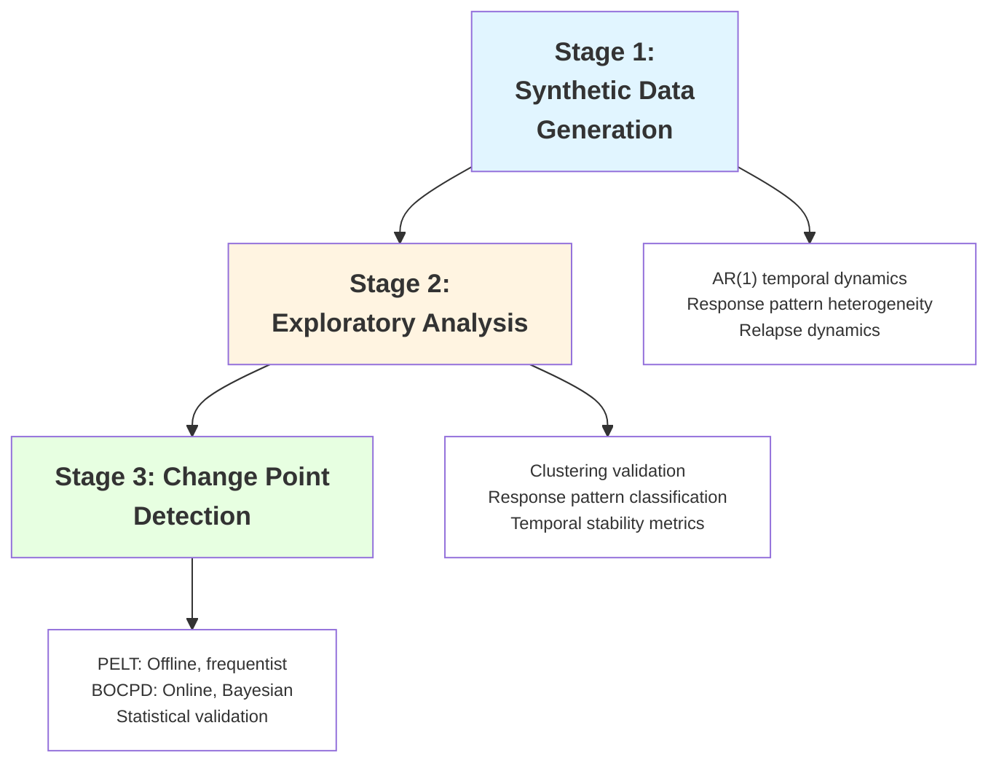
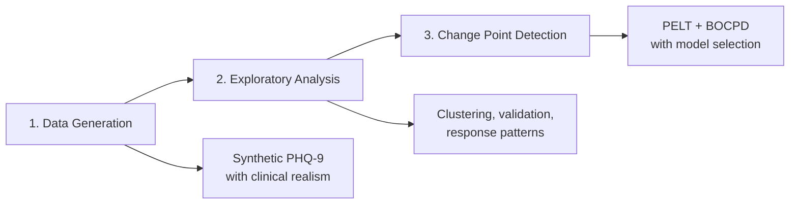

<div align="center">

# Temporal Change-Point Detection on PHQ-9 Data

[](https://www.python.org/downloads/)
[](https://opensource.org/licenses/MIT)
[](https://github.com/psf/black)

> **End-to-end pipeline for detecting regime shifts in population-level mental health data through clinically grounded synthesis, rigorous exploratory analysis, and dual-algorithm change point detection.**

[Quick Start](#-quick-start) • [Problem Statement](#-problem-statement) • [Documentation](#-table-of-contents) • [Whitepaper](WHITEPAPER.md)

</div>

---

## 📊 Problem Statement

### **The Core Challenge**

Mental health monitoring generates **sparse, irregular longitudinal data** from thousands of patients. The critical question is not *"What will happen next?"* but rather *"When did the underlying population dynamics fundamentally change?"*

This is a **structural change detection problem**, not a forecasting problem.

---

### **Why Change Point Detection Over Time Series Modeling?**

#### **1. Sparse, Irregular Observations**

Traditional time series methods (ARIMA, LSTM, Prophet) assume:
- Regular sampling intervals
- Dense observations
- Sufficient per-patient data for individual modeling

**PHQ-9 reality:**
- Patients assessed every 2-8 weeks (irregular)
- ~95% missing data (structural sparsity)
- Individual trajectories too sparse for reliable forecasting

```
Individual Patient View (Traditional Time Series Domain):
Patient A: [15] -------- [12] ------------ [9] -------- [missing]
Patient B: [18] -- [16] -------- [missing] -- [14] ---- [11]
Patient C: [14] ------------ [missing] -------- [8] -- [7]
          ↓
Problem: Cannot fit ARIMA/LSTM on individual sparse sequences
```

#### **2. Population-Level Regime Shifts**

We aggregate to **daily population statistics** (mean, CV) to detect system-wide changes:

```
Aggregated Population View (Change Point Domain):
Day   Mean    CV     Status
0     16.2   0.35   [Baseline - High severity, high variance]
45    15.8   0.33   ← Potential change point
90    12.4   0.28   [Treatment effect - Lower severity, reduced variance]
180   11.9   0.26   ← Plateau phase
270   13.5   0.31   ← Relapse signal
```

**Key insight:** We detect when the **distribution** of outcomes shifts, not predict individual trajectories.

---

### **Problem Formalization**

Given:
- `N` patients with sparse PHQ-9 scores over `T` days
- Daily aggregated coefficient of variation: `CV(t) = σ(t) / μ(t)`

**Objective:** Identify time points `τ₁, τ₂, ..., τₖ` where the stochastic process governing `CV(t)` undergoes a structural break.

**Mathematical definition:**
```
∃ τ : P(CV(t) | t < τ) ≠ P(CV(t) | t ≥ τ)
```

Where `P` represents the probability distribution characterized by:
- Mean level (symptom severity)
- Variance (population heterogeneity)
- Temporal autocorrelation

---

### **Why Not Traditional Time Series Approaches?**

| Approach | Why It Fails for This Problem |
|----------|-------------------------------|
| **ARIMA/SARIMA** | Assumes stationarity; cannot detect regime changes without manual differencing |
| **LSTM/RNN** | Requires dense sequences; 95% missingness destroys gradient flow |
| **Prophet** | Designed for forecasting with trend+seasonality; doesn't identify structural breaks |
| **Kalman Filter** | State-space model assumes known transition dynamics; we seek unknown breakpoints |
| **VAR** | Multivariate time series, but we need univariate regime detection on aggregates |

**Change point detection**, by contrast:
- ✅ Explicitly models distributional shifts
- ✅ Works on sparse aggregated signals
- ✅ Provides statistical validation of detected changes
- ✅ No forecasting assumption—only segmentation

---

### **Solution Approach**

Our pipeline addresses the problem through three stages:



#### **Stage 1: Clinically Grounded Synthesis**

**Rationale:** Real PHQ-9 data is scarce and privacy-restricted. We generate synthetic data that replicates clinical patterns.

**Key features:**
- **AR(1) temporal model** with gap-aware decay: `α^Δt` handles irregular sampling
- **Response heterogeneity:** Early (30%), gradual (35%), late (15%), non-responders (20%)
- **Relapse dynamics:** Exponential/gamma/lognormal distributions
- **Missingness:** 95% structural sparsity + informative dropout

**Output:** 1000 patients × 365 days with metadata sidecars for validation.

#### **Stage 2: Exploratory Data Analysis**

**Rationale:** Validate synthetic data quality and understand temporal structure before detection.

**Key analyses:**
- **Temporal clustering** on daily aggregates (mean, CV, severity %)
- **Response pattern validation** (observed vs. expected distribution)
- **Plateau detection** (symptom stabilization phases)
- **Relapse identification** (≥3 point increases with 7-30 day gaps)

**Output:** Quality metrics, comparative rankings, visual diagnostics.

#### **Stage 3: Dual-Algorithm Detection**

**Rationale:** Combine frequentist and Bayesian paradigms for robust detection.

| Algorithm | Paradigm | Strengths | Validation |
|-----------|----------|-----------|------------|
| **PELT** | Offline, frequentist | Optimal segmentation, multiple cost functions | Mann-Whitney U, effect sizes |
| **BOCPD** | Online, Bayesian | Posterior probabilities, uncertainty quantification | Posterior thresholds, credible intervals |

**Model selection:** Cross-model agreement + statistical rigor → explainable recommendations.

---

### **Core Assumptions**

1. **Aggregation preserves signal:** Population-level CV captures meaningful clinical shifts
2. **Sparsity is structural:** Missing data is not informative for detection (after dropout handling)
3. **Temporal independence of errors:** After accounting for AR(1), residuals are i.i.d.
4. **Stationarity within segments:** Between change points, CV follows stable distribution
5. **Finite change points:** Number of regime shifts is small (k << T)

---

### **Key Constraints**

| Type | Constraint | Implication |
|------|------------|-------------|
| **Data** | 95% missing individual observations | Cannot model individual trajectories |
| **Clinical** | PHQ-9 only every 2-8 weeks | Irregular sampling intervals |
| **Statistical** | Small effect sizes in mental health | Need robust statistical validation |
| **Computational** | 1000 patients × 365 days | Algorithms must scale to ~365K data points |
| **Interpretability** | Must explain to clinicians | Require transparent statistical tests |

---

### **What This Pipeline Is NOT**

❌ **Not a forecasting tool:** We don't predict future PHQ-9 scores  
❌ **Not individual-level:** We analyze population aggregates, not single patients  
❌ **Not a diagnostic system:** PHQ-9 screening only, not clinical diagnosis  
❌ **Not real-time monitoring:** Detection is retrospective on accumulated data  

✅ **What it IS:** A research pipeline for detecting when population mental health dynamics fundamentally changed.

---

## 🎯 Project Overview

### **Three-Stage Pipeline**



**What makes this unique:**
- **Clinically grounded synthesis:** Real response patterns, plateau phases, relapse dynamics
- **Metadata-aware validation:** Provenance tracking for reproducibility
- **Comparative EDA:** Automated ranking by temporal stability and clinical realism
- **Dual-algorithm detection:** Frequentist + Bayesian with rigorous validation
- **Production-ready:** Config-driven, extensible, fully logged

---

## 📋 Table of Contents

1. [Quick Start](#-quick-start)
2. [System Architecture](#-system-architecture)
3. [Module Descriptions](#-module-descriptions)
4. [Clinical Context](#-clinical-context)
5. [Installation](#-installation)
6. [Complete Pipeline Example](#-complete-pipeline-example)
7. [Configuration](#-configuration)
8. [Results & Interpretation](#-results--interpretation)
9. [References](#-references)

---

## 🚀 Quick Start

### Minimal Example (3 Commands)

```bash
# 1. Generate synthetic data with clinical realism
python scripts/run_generation.py --patients 1000 --days 365 --enable-response-patterns

# 2. Perform exploratory analysis
python scripts/run_eda.py --data data/raw/synthetic_phq9_data.csv

# 3. Detect change points
python scripts/run_detection.py --data data/raw/synthetic_phq9_data.csv --execution-mode ensemble
```

**Output:** Change points validated with statistical tests, ranked by cross-model agreement.

---

## 🏗 System Architecture

### High-Level Data Flow

```
┌─────────────────────────────────────────────────────────────┐
│                    GENERATION MODULE                        │
│  • Synthetic PHQ-9 with AR(1) + response patterns           │
│  • Relapse dynamics (exponential/gamma/lognormal)           │
│  • Metadata sidecars for provenance tracking                │
└────────────────────────┬────────────────────────────────────┘
                         │
                         ▼
┌─────────────────────────────────────────────────────────────┐
│                       EDA MODULE                            │
│  • KMeans/temporal clustering on daily features             │
│  • Response pattern classification                          │
│  • Relapse detection, plateau analysis                      │
│  • Metadata-aware validation                                │
│  • Multi-dataset comparison & ranking                       │
└────────────────────────┬────────────────────────────────────┘
                         │
                         ▼
┌─────────────────────────────────────────────────────────────┐
│                   DETECTION MODULE                          │
│  • PELT (offline, frequentist) with BIC penalty tuning      │
│  • BOCPD (online, Bayesian) with hazard tuning              │
│  • Statistical validation (Mann-Whitney U, effect sizes)    │
│  • Model selection via cross-model agreement                │
└─────────────────────────────────────────────────────────────┘
```

### Module Independence

Each module is **self-contained** with its own:
- Configuration (`config/*.py`)
- README (`src/*/README.md`)
- Validation framework
- Logging infrastructure

**Key insight:** Modules can run independently (e.g., detection on real data without generation).

---

## 📦 Module Descriptions

### **1. Generation Module** (`src/generation/`)

**Purpose:** Produce clinically realistic synthetic PHQ-9 data for pipeline validation.

**Features:**
- **Gap-aware AR(1)** temporal model (`α^Δt` decay)
- **Response pattern heterogeneity:** Early/gradual/late/non-responders
- **Plateau logic:** Symptom stabilization after response
- **Three relapse distributions:** Exponential/gamma/lognormal
- **Missingness:** MCAR + informative dropout (21% STAR*D-aligned)

**See:** `src/generation/README.md`

---

### **2. EDA Module** (`src/eda/`)

**Purpose:** Validate and characterize datasets before change point detection.

**Features:**
- **Clustering:** KMeans + temporal-aware on daily features
- **Response patterns:** Classify by trajectory slope and 12-week improvement
- **Plateau detection:** Variance + slope windowing
- **Relapse detection:** ≥3 point increases with 7-30 day gaps
- **Multi-dataset comparison:** Rank by temporal stability

**See:** `src/eda/README.md`

---

### **3. Detection Module** (`src/detection/`)

**Purpose:** Detect and validate significant temporal shifts.

**Algorithms:**
1. **PELT:** Offline, frequentist, BIC-based penalty tuning
2. **BOCPD:** Online, Bayesian, hazard tuning

**Validation:**
- Mann-Whitney U tests with FDR correction
- Effect size thresholds (Cohen's d ≥ 0.3)
- Cross-model agreement metrics

**See:** `src/detection/README.md`

---

## ⚕️ Clinical Context

### What is PHQ-9?

**Patient Health Questionnaire-9:** Validated 9-item self-report for depression screening.

**Severity scale (0-27):**
- 0-4: Minimal
- 5-9: Mild
- 10-14: Moderate
- 15-19: Moderately severe
- 20-27: Severe

### Why Change Point Detection?

**Research questions:**
1. When do population-level symptoms shift significantly?
2. Do policy changes coincide with symptom pattern shifts?
3. Are seasonal/environmental triggers detectable?
4. How stable are mental health trajectories?

**Use cases:**
- Clinical trials (treatment effect timing)
- Population health monitoring
- Quality improvement initiatives
- Policy evaluation

---

## 🛠 Installation

### Requirements

- Python 3.8+
- Core: `numpy`, `pandas`, `scipy`, `matplotlib`, `seaborn`
- ML: `scikit-learn`, `ruptures`
- Config: `pydantic`

### Setup

```bash
# Clone repository
git clone https://github.com/satyaki-mitra/phq9-changepoint-detection.git
cd phq9-changepoint-detection

# Install dependencies
pip install -r requirements.txt

# Verify
python -c "import ruptures, pydantic; print('Ready!')"
```

---

## 🎬 Complete Pipeline Example

```bash
# Generate three datasets
python scripts/run_generation.py --relapse-dist exponential --patients 1000 --days 365
python scripts/run_generation.py --relapse-dist gamma --patients 1000 --days 365
python scripts/run_generation.py --relapse-dist lognormal --patients 1000 --days 365

# Compare distributions
python scripts/compare_distributions.py --data-dir data/raw --patterns exponential gamma lognormal

# Detect change points on best dataset
python scripts/run_detection.py --execution-mode ensemble --data data/raw/synthetic_phq9_data_exponential.csv
```

---

## ⚙️ Configuration

All behavior is **config-driven** via Pydantic:
- `generation_config.py`: AR coefficient, recovery rate, relapse distribution
- `eda_config.py`: Clustering parameters, temporal weighting
- `detection_config.py`: Penalty, hazard, statistical thresholds
- `model_selection_config.py`: Metric weights, agreement scoring

**Example:**
```python
from config.detection_config import ChangePointDetectionConfig

config = ChangePointDetectionConfig(
    execution_mode='ensemble',
    auto_tune_penalty=True,
    alpha=0.01,  # Conservative testing
    effect_size_threshold=0.5
)
```

---

## 📊 Results & Interpretation

### Generation Validation

**Check:**
- ✅ Autocorrelation 0.30-0.70
- ✅ Baseline severity 13-19
- ✅ 12-week response 40-70%
- ✅ Missingness ~95%

### Change Point Output

```json
{
  "n_changepoints": 3,
  "n_significant": 2,
  "change_points": [45, 120, 210],
  "validation": {
    "summary": {
      "mean_effect_size": 0.65,
      "fraction_significant": 0.67
    }
  }
}
```

**Interpretation:**
- **Effect size >0.5:** Large population shifts
- **Fraction significant:** Proportion passing statistical validation

---

## ⚠️ Limitations & Future Work

### Current Limitations
1. **Univariate only**: Detects shifts in CV only (not multivariate patterns)
2. **Retrospective**: Not real-time (though BOCPD supports online)
3. **PHQ-9 specific**: Some clinical constants are PHQ-9 specific

### Planned Extensions
1. **Multivariate CPD**: Detect correlated shifts across multiple metrics
2. **Hierarchical models**: Patient subgroup-aware detection
3. **Real-time dashboard**: Streamlit/Plotly visualization
4. **Alternative scales**: Extend to GAD-7, PHQ-15, etc.

---

## 📚 References

1. **PELT:** Killick et al. (2012). *J. American Statistical Association*
2. **BOCPD:** Adams & MacKay (2007). *arXiv:0710.3742*
3. **PHQ-9:** Kroenke et al. (2001). *J. General Internal Medicine*
4. **STAR*D:** Rush et al. (2006). *American J. Psychiatry*
5. **Change Point Review:** Truong et al. (2020). *Signal Processing*

---

## 📄 License

MIT License. **Research purposes only—not for clinical use.**

---

## 👤 Author

**Satyaki Mitra**  
Data Scientist | ML Enthusiast | Clinical AI Research

---

## 🌟 Acknowledgments

- **ruptures** library (Truong et al.)
- STAR*D investigators
- PHQ-9 developers

---

**For detailed methodology, see [WHITEPAPER.md](WHITEPAPER.md)**