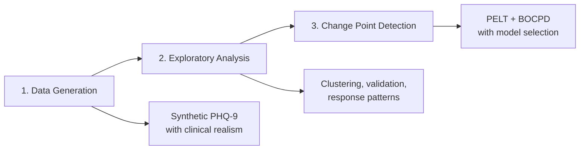

# Temporal Change-Point Detection on PHQ-9 Data

[](https://www.python.org/downloads/)
[](https://opensource.org/licenses/MIT)
[](https://github.com/psf/black)

> **Comprehensive end-to-end pipeline for detecting significant temporal shifts in longitudinal mental health data using clinically grounded synthetic generation, rigorous exploratory analysis, and dual-algorithm change point detection.**

---

## 🎯 Project Overview

This repository implements a **complete research pipeline** for temporal change point detection on Patient Health Questionnaire-9 (PHQ-9) depression severity scores. The system is designed for **population-level analysis** of mental health trajectories, enabling identification of critical shifts in symptom patterns over time.

### **Three-Stage Pipeline**



**What makes this unique:**
- **Clinically grounded synthesis**: Not just random noise—real response patterns, plateau phases, relapse dynamics
- **Metadata-aware validation**: Generated data includes provenance tracking for reproducibility
- **Comparative EDA**: Automated ranking of datasets by temporal stability and clinical realism
- **Dual-algorithm detection**: Frequentist (PELT) and Bayesian (BOCPD) approaches with rigorous statistical validation
- **Production-ready**: Config-driven, extensible, fully logged, thoroughly documented

---

## 📋 Table of Contents

1. [Quick Start](#-quick-start)
2. [System Architecture](#-system-architecture)
3. [Module Descriptions](#-module-descriptions)
4. [Clinical Context](#-clinical-context)
5. [Installation](#-installation)
6. [Complete Pipeline Example](#-complete-pipeline-example)
7. [Configuration](#-configuration)
8. [Results & Interpretation](#-results--interpretation)
9. [References](#-references)
10. [Contributing](#-contributing)

---

## 🚀 Quick Start

### Minimal Example (3 Commands)

```bash
# 1. Generate synthetic data with clinical realism
python scripts/run_generation.py --patients 1000 --days 365 --enable-response-patterns

# 2. Perform exploratory analysis
python scripts/run_eda.py --data data/raw/synthetic_phq9_data.csv

# 3. Detect change points
python scripts/run_detection.py --data data/raw/synthetic_phq9_data.csv --execution-mode ensemble
```

**Output**: Change points validated with statistical tests, ranked by cross-model agreement, with comprehensive visualizations.

---

## 🏗 System Architecture

### High-Level Data Flow

```
┌─────────────────────────────────────────────────────────────────┐
│                    GENERATION MODULE                            │
│  • Synthetic PHQ-9 with AR(1) + response patterns               │
│  • Relapse dynamics (exponential/gamma/lognormal)               │
│  • Metadata sidecars for provenance tracking                    │
└────────────────────────────┬────────────────────────────────────┘
                             │
                             ▼
┌─────────────────────────────────────────────────────────────────┐
│                       EDA MODULE                                │
│  • KMeans/temporal clustering on daily features                 │
│  • Response pattern classification (early/gradual/late/non)     │
│  • Relapse detection, plateau analysis                          │
│  • Metadata-aware validation                                    │
│  • Multi-dataset comparison & ranking                           │
└────────────────────────────┬────────────────────────────────────┘
                             │
                             ▼
┌─────────────────────────────────────────────────────────────────┐
│                   DETECTION MODULE                              │
│  • PELT (offline, frequentist) with BIC penalty tuning          │
│  • BOCPD (online, Bayesian) with hazard tuning                  │
│  • Statistical validation (Mann-Whitney U, effect sizes)        │
│  • Model selection via cross-model agreement                    │
└─────────────────────────────────────────────────────────────────┘
```

### Module Independence

Each module is **self-contained** with its own:
- Configuration (`config/*.py`)
- README (`src/*/README.md`)
- Validation framework
- Logging infrastructure

**Key insight**: You can run modules independently (e.g., detection on real data without generation).

---

## 📦 Module Descriptions

### **1. Generation Module** (`src/generation/`)

**Purpose**: Produce clinically realistic synthetic PHQ-9 data for pipeline validation and algorithm benchmarking.

**Features**:
- **Gap-aware AR(1)** temporal model (`α^Δt` decay for irregular sampling)
- **Response pattern heterogeneity**: Early (30%), gradual (35%), late (15%), non-responders (20%)
- **Plateau logic**: Symptom stabilization after response with reduced noise
- **Three relapse distributions**: Exponential, gamma, lognormal for comparison
- **Missingness**: MCAR + informative dropout (STAR*D-aligned 21% rate)
- **Metadata sidecars**: JSON files with config hash, response pattern distribution, relapse stats

**Key outputs**:
- `synthetic_phq9_data_{distribution}.csv` (1000 patients × 365 days, ~95% sparse)
- `synthetic_phq9_data_{distribution}.metadata.json`
- `validation_report_{timestamp}.json`

**See**: `src/generation/README.md` for mathematical details.

---

### **2. EDA Module** (`src/eda/`)

**Purpose**: Validate, characterize, and compare PHQ-9 datasets before change point detection.

**Features**:
- **Clustering**: KMeans + temporal-aware clustering on daily features (mean, CV, severity %)
- **Response pattern analysis**: Classify patients by trajectory slope and 12-week improvement
- **Plateau detection**: Identify symptom stabilization phases using variance + slope windows
- **Relapse detection**: Flag clinically meaningful score increases (≥3 points, 7-30 day gaps)
- **Metadata integration**: Validate observed vs expected statistics
- **Multi-dataset comparison**: Rank datasets by temporal stability, clinical realism, statistical quality

**Key outputs**:
- `cluster_results.png`, `response_patterns.png`, `relapse_events.png`
- `summary_statistics.csv`, `response_pattern_analysis.csv`
- `dataset_comparison.csv` (for multi-dataset mode)

**See**: `src/eda/README.md` for methods table and algorithm mapping.

---

### **3. Detection Module** (`src/detection/`)

**Purpose**: Detect and validate significant temporal shifts in aggregated PHQ-9 statistics.

**Algorithms**:
1. **PELT** (Pruned Exact Linear Time)
   - Offline, frequentist
   - Cost functions: L1 (robust), L2, RBF, AR
   - BIC-based penalty tuning
   - Mann-Whitney U testing with FDR correction

2. **BOCPD** (Bayesian Online Change Point Detection)
   - Online, Bayesian
   - Gaussian likelihood with empirical Bayes prior
   - Hazard tuning via heuristic or predictive likelihood
   - Posterior probability thresholding

**Model selection**:
- Cross-model agreement metrics (temporal consensus, boundary density)
- Weighted composite scoring
- Explainable selection with ranking

**Key outputs**:
- `all_model_results.json`, `model_selection.json`
- `best_model/model_result.json`
- `aggregated_cv_all_models.png`, `model_comparison_grid.png`

**See**: `src/detection/README.md` for algorithm details and fixed bugs.

---

## ⚕️ Clinical Context

### What is PHQ-9?

The **Patient Health Questionnaire-9** is a validated 9-item self-report measure for:
- Depression screening and diagnosis
- Severity quantification (0-27 scale)
- Longitudinal symptom monitoring
- Treatment response evaluation

**Severity interpretation**:
- 0-4: Minimal
- 5-9: Mild
- 10-14: Moderate
- 15-19: Moderately severe
- 20-27: Severe

### Why Change Point Detection?

**Research questions this pipeline addresses**:
1. When do population-level depression symptoms shift significantly?
2. Do treatment policy changes coincide with symptom pattern shifts?
3. Are there seasonal or environmental triggers detectable in aggregate data?
4. How stable are mental health trajectories over 6-12 months?

**Use cases**:
- **Clinical trials**: Detect when treatment effects emerge
- **Population health**: Monitor community mental health trends
- **Quality improvement**: Identify when clinic-wide outcomes change
- **Policy evaluation**: Assess impact of mental health interventions

### Clinical Validity

**Generation module**:
- Response rates aligned with STAR*D trial (~47% at 12 weeks)
- Baseline severity typical of RCTs (PHQ-9 15-17)
- Dropout patterns match real-world attrition (21%)
- Autocorrelation reflects PHQ-9 test-retest reliability (r=0.84)

**EDA module**:
- Response pattern thresholds from antidepressant literature
- Relapse magnitude consistent with clinical observations
- Plateau detection captures maintenance phase

**Detection module**:
- Aggregated CV statistic captures population heterogeneity
- Statistical thresholds (α=0.05, Cohen's d≥0.3) are standard
- Change points represent shifts in symptom variability, not individual scores

---

## 🛠 Installation

### Requirements

- Python 3.8+
- Core: `numpy`, `pandas`, `scipy`, `matplotlib`, `seaborn`
- ML: `scikit-learn`, `ruptures`
- Config: `pydantic`

### Setup

```bash
# Clone repository
git clone https://github.com/satyaki-mitra/phq9-changepoint-detection.git
cd phq9-changepoint-detection

# Install dependencies
pip install -r requirements.txt

# Verify installation
python -c "import ruptures, pydantic; print('Installation successful!')"
```

### Directory Structure

```plaintext
phq9_analysis/
├── config/                     # Pydantic configurations
│   ├── clinical_constants.py
│   ├── generation_config.py
│   ├── eda_config.py
│   ├── eda_constants.py
│   ├── detection_config.py
│   └── model_selection_config.py
├── data/
│   ├── raw/                    # Generated datasets
│   └── processed/              # EDA outputs
├── src/
│   ├── generation/             # Synthetic data module
│   ├── eda/                    # Exploratory analysis module
│   ├── detection/              # Change point detection module
│   └── utils/                  # Shared utilities (logging)
├── scripts/                    # CLI entry points
│   ├── run_generation.py
│   ├── run_eda.py
│   ├── compare_distributions.py
│   └── run_detection.py
├── results/                    # All outputs
│   ├── generation/
│   ├── eda/
│   ├── comparison/
│   └── detection/
├── logs/                       # Execution logs
├── notebooks/                  # Jupyter exploration
└── README.md                   # This file
```

---

## 🎬 Complete Pipeline Example

### Scenario: Evaluate Three Relapse Distributions

**Goal**: Generate data with exponential, gamma, and lognormal relapse distributions, perform EDA on all three, compare them, select the best, then detect change points.

```bash
#!/bin/bash

# ============================================================
# STEP 1: GENERATE THREE DATASETS
# ============================================================

echo "Generating exponential distribution..."
python scripts/run_generation.py \
    --relapse-dist exponential \
    --patients 1000 \
    --days 365 \
    --enable-response-patterns \
    --enable-plateau \
    --output data/raw/synthetic_phq9_data_exponential.csv \
    --seed 2023

echo "Generating gamma distribution..."
python scripts/run_generation.py \
    --relapse-dist gamma \
    --patients 1000 \
    --days 365 \
    --enable-response-patterns \
    --enable-plateau \
    --output data/raw/synthetic_phq9_data_gamma.csv \
    --seed 2023

echo "Generating lognormal distribution..."
python scripts/run_generation.py \
    --relapse-dist lognormal \
    --patients 1000 \
    --days 365 \
    --enable-response-patterns \
    --enable-plateau \
    --output data/raw/synthetic_phq9_data_lognormal.csv \
    --seed 2023

# ============================================================
# STEP 2: RUN EDA ON ALL THREE + COMPARE
# ============================================================

echo "Comparing distributions..."
python scripts/compare_distributions.py \
    --data-dir data/raw \
    --output-dir results/comparison \
    --patterns exponential gamma lognormal

# Output: Recommended dataset based on composite score

# ============================================================
# STEP 3: DETECT CHANGE POINTS ON BEST DATASET
# ============================================================

# Assume comparison recommends exponential
BEST_DATASET="data/raw/synthetic_phq9_data_exponential.csv"

echo "Running change point detection on best dataset..."
python scripts/run_detection.py \
    --execution-mode ensemble \
    --detectors pelt bocpd \
    --data $BEST_DATASET \
    --auto-tune-penalty \
    --auto-tune-hazard \
    --output-dir results/detection/best_model

echo "Pipeline complete! Check results/detection/best_model/"
```

**Outputs**:
- `results/comparison/comparison_summary/dataset_comparison.csv` → Ranked datasets
- `results/detection/best_model/model_result.json` → Selected change points
- `results/detection/plots/*.png` → Visualizations

---

## ⚙️ Configuration

### Philosophy

**All behavior is config-driven** via Pydantic models:
- No magic numbers in code
- CLI arguments override config defaults
- Configs are validated on instantiation
- JSON-serializable for reproducibility

### Key Config Files

| File | Purpose | Key Parameters |
|------|---------|----------------|
| `generation_config.py` | Synthetic data generation | `ar_coefficient`, `recovery_rate_mean`, `relapse_distribution` |
| `eda_config.py` | Exploratory analysis | `max_clusters_to_test`, `use_temporal_clustering` |
| `detection_config.py` | Change point detection | `penalty`, `hazard_lambda`, `alpha` |
| `model_selection_config.py` | Model ranking | `metric_weights`, `agreement_weight` |

### Example: Custom Detection Run

```python
from config.detection_config import ChangePointDetectionConfig
from src.detection.detector import ChangePointDetectionOrchestrator

# Override defaults
config = ChangePointDetectionConfig(
    execution_mode='compare',
    detectors=['pelt', 'bocpd'],
    pelt_cost_models=['l1', 'rbf'],  # Only test robust cost functions
    auto_tune_penalty=True,
    auto_tune_hazard=True,
    alpha=0.01,  # More conservative testing
    effect_size_threshold=0.5,  # Larger effects only
)

orchestrator = ChangePointDetectionOrchestrator(config)
results = orchestrator.run()
```

---

## 📊 Results & Interpretation

### Generation Validation Report

**What to check**:
- ✅ Autocorrelation in expected range (0.30-0.70 for sparse data)
- ✅ Baseline severity 13-19 (moderate-severe depression)
- ✅ 12-week response rate 40-70% (STAR*D benchmark)
- ✅ Missingness ~95% (structural sparsity + dropout)

**Warning flags**:
- Observed response patterns deviate >10% from expected → Check recovery rate
- Excess missingness >10% → Dropout rate too high
- Autocorrelation <0.3 → Temporal gaps too large

---

### EDA Cluster Analysis

**Interpretation**:
- **2-3 clusters**: Stable period, recovery period, plateau
- **5+ clusters**: High temporal instability, may indicate model issues
- **Silhouette score >0.5**: Good separation
- **Silhouette score <0.3**: Poor clustering, consider temporal weighting

**Response pattern distribution**:
- Compare observed vs metadata expected
- Match score >90% → Excellent alignment
- Match score <70% → Noise suppressing signal

---

### Change Point Detection

**PELT output**:
```json
{
  "n_changepoints": 3,
  "n_significant": 2,
  "change_points": [45, 120, 210],
  "validation": {
    "summary": {
      "mean_effect_size": 0.65,
      "fraction_significant": 0.67
    }
  }
}
```

**Interpretation**:
- **n_significant < n_changepoints**: Some CPs failed validation (structural issues or small effects)
- **Mean effect size >0.5**: Large population-level shifts
- **Rejected CPs**: Check `rejected` dict for reasons (too close to boundaries, insufficient samples)

**BOCPD output**:
```json
{
  "n_changepoints": 2,
  "validation": {
    "summary": {
      "mean_posterior_at_cp": 0.82,
      "coverage_ratio": 0.10
    }
  }
}
```

**Interpretation**:
- **Mean posterior >0.7**: Strong Bayesian evidence
- **Coverage ratio <0.15**: Sparse change points (as expected)
- **No change points detected**: Lower threshold or check signal variability

---

## 📚 References

### Core Papers

1. **PELT Algorithm**: Killick, R., Fearnhead, P., & Eckley, I. A. (2012). Optimal detection of changepoints with a linear computational cost. *Journal of the American Statistical Association*, 107(500), 1590-1598.

2. **BOCPD Algorithm**: Adams, R. P., & MacKay, D. J. (2007). Bayesian online changepoint detection. *arXiv preprint arXiv:0710.3742*.

3. **PHQ-9 Validation**: Kroenke, K., Spitzer, R. L., & Williams, J. B. (2001). The PHQ-9: validity of a brief depression severity measure. *Journal of General Internal Medicine*, 16(9), 606-613.

4. **STAR*D Trial**: Rush, A. J., et al. (2006). Acute and longer-term outcomes in depressed outpatients requiring one or several treatment steps: a STAR*D report. *American Journal of Psychiatry*, 163(11), 1905-1917.

5. **Change Point Review**: Truong, C., Oudre, L., & Vayatis, N. (2020). Selective review of offline change point detection methods. *Signal Processing*, 167, 107299.

---

## 📜 License

This project is licensed under the MIT License - see the [LICENSE](LICENSE) file for details.

**Note**: This pipeline is designed for research purpose only. Not intended for clinical use.

---

## 🙋 Authors & Contact

**Satyaki Mitra**  
*Data Scientist | ML Enthusiast | Clinical AI Research*

---

## 🌟 Acknowledgments

- **ruptures** library by Charles Truong et al. for PELT implementation
- **STAR*D** investigators for clinical benchmarks
- **PHQ-9** developers (Kroenke, Spitzer, Williams)

---

*Built with care for rigorous, reproducible mental health research.*