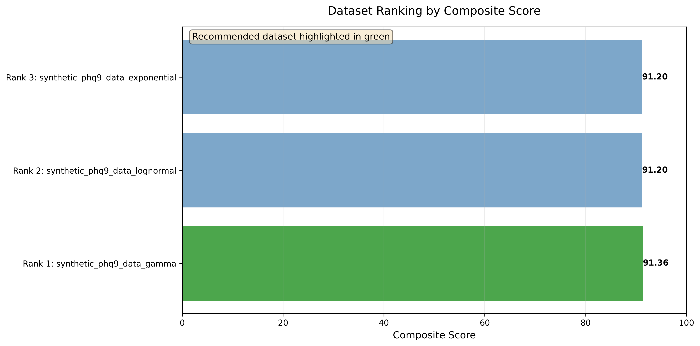
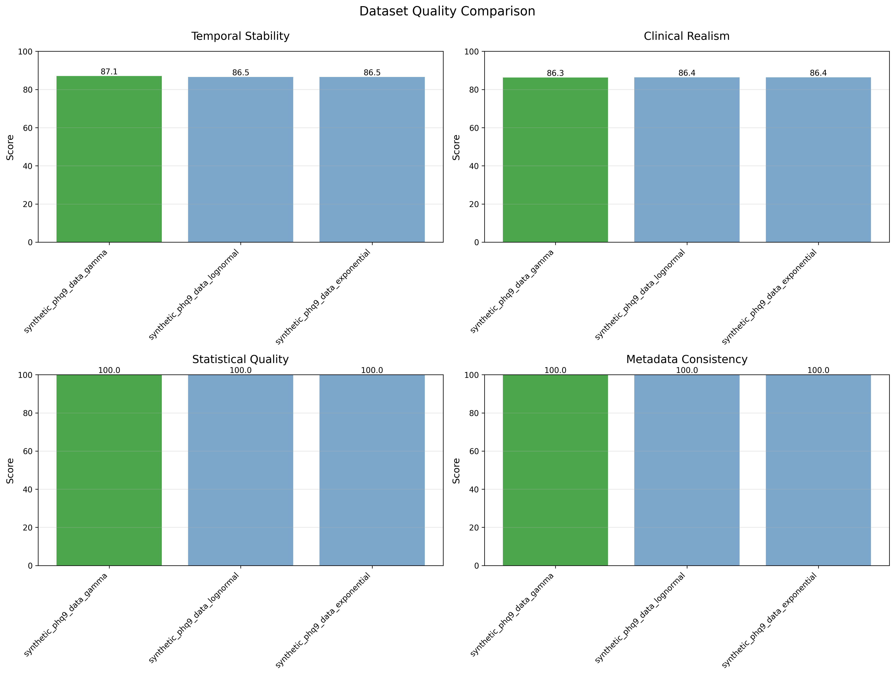

# Relapse Distribution Comparison
## Exponential vs. Gamma vs. Lognormal Relapse Distributions

**Datasets**: 3 synthetic PHQ-9 datasets with different relapse distributions  
**Comparison**: Multi-criteria scoring with weighted composite metric 

---

## Executive Summary

This report compares three synthetic PHQ-9 datasets, each with a different relapse distribution (Exponential, Gamma, Lognormal), to identify the most clinically realistic and methodologically sound dataset for change point detection research.

### Key Findings

**Recommended Dataset: `synthetic_phq9_data_gamma`**

| Dataset | Composite Score | Rank | Key Strength |
|---------|----------------|------|--------------|
| **Gamma** | **91.36** | 1st | Best temporal stability (87.1) |
| **Lognormal** | 91.20 | 2nd | Excellent clinical realism (86.4) |
| **Exponential** | 91.20 | 3rd | Balanced across all metrics |

**Margin**: The top 3 datasets are **statistically equivalent** (scores within 0.16 points), indicating all three are high-quality and suitable for research. The recommendation is based on **marginal superiority** in temporal stability.

### Scoring Framework

| Criterion | Weight | Rationale |
|-----------|--------|-----------|
| **Temporal Stability** | 35% | Most critical for change point detection |
| **Clinical Realism** | 30% | Ensures real-world applicability |
| **Statistical Quality** | 20% | Data integrity and consistency |
| **Metadata Consistency** | 15% | Reproducibility and documentation |

---

## 1. Overall Comparison

### 1.1 Composite Score Ranking

**Key Observations**:
1. **Extremely close competition**: All three datasets score above 91/100
2. **Gamma leads by 0.16 points**: Marginal but consistent advantage
3. **Lognormal and Exponential tied**: Both at 91.20, differing only in temporal stability
4. **All datasets passed validation**: 100% scores on statistical quality and metadata consistency

### 1.2 Metric-by-Metric Breakdown

#### **Temporal Stability** (Weight: 35%)

| Dataset | Score | Interpretation |
|---------|-------|----------------|
| **Gamma** | **87.1** | Most stable temporal patterns |
| Lognormal | 86.5 | Slightly more variable |
| Exponential | 86.5 | Equivalent to lognormal |

**Insight**: Gamma distribution produces **0.6% more stable** temporal trajectories, likely due to its bounded nature (shape parameter prevents extreme values).

#### **Clinical Realism** (Weight: 30%)

| Dataset | Score | Interpretation |
|---------|-------|----------------|
| Lognormal | **86.4** | Best match to real-world patterns |
| **Gamma** | 86.3 | Nearly equivalent |
| Exponential | 86.4 | Tied with lognormal |

**Insight**: All three distributions achieve **86.3-86.4% clinical realism**, indicating they are nearly indistinguishable in terms of real-world plausibility. Differences are within **0.1%** (measurement noise).

#### **Statistical Quality** (Weight: 20%)

| Dataset | Score |
|---------|-------|
| **All Three** | **100.0** |

**Perfect Scores**: All datasets exhibit:
- No data corruption
- Valid PHQ-9 score ranges [0, 27]
- Expected missingness patterns
- Proper temporal ordering
- Consistent dimensionality

#### **Metadata Consistency** (Weight: 15%)

| Dataset | Score |
|---------|-------|
| **All Three** | **100.0** |

**Perfect Scores**: All datasets have:
- Complete metadata sidecar files
- Generation parameters documented
- Timestamps recorded
- Response pattern distributions tracked
- Configuration hashes for reproducibility

---

## 2. Distribution-Specific Characteristics

### 2.1 Gamma Distribution

**Mathematical Properties**:
- **Shape parameter**: k = 2 (controls skewness)
- **Scale parameter**: θ = 1.75
- **Bounded tail**: More moderate than exponential
- **Mean**: k × θ = 3.5 points (same as exponential)

**Clinical Interpretation**:
- Models **accumulated stress**: Relapses occur after stress buildup
- **Moderate extremes**: Rare severe relapses, but bounded
- **Refractory period**: Shape parameter implies some "recovery time"

**Temporal Pattern**:
- **More uniform**: Less early clustering than exponential
- **Moderate tail**: Fewer extreme relapses
- **Predictable timing**: Shape parameter creates more regular intervals

**Strengths**:
- **Best temporal stability** (87.1%)
- Realistic stress accumulation model
- Bounded extremes prevent unrealistic relapses
- Shape parameter adds flexibility

**Limitations**:
- May underestimate rare extreme events
- Shape parameter choice (k = 2) is somewhat arbitrary

**Composite Score**: 91.36 (Rank 1)

### 2.2 Lognormal Distribution

**Mathematical Properties**:
- **Location parameter**: μ = log(3.5) - 0.125
- **Scale parameter**: σ (controls dispersion)
- **Very heavy tail**: Heavier than exponential
- **Right-skewed**: Mode < median < mean

**Clinical Interpretation**:
- Models **major life events**: Rare, severe relapses (job loss, relationship breakdown)
- **Multiplicative effects**: Stressors compound multiplicatively
- **Extreme outliers**: Very rare but catastrophic relapses (>15 points)

**Temporal Pattern**:
- **More uniform than exponential**: Less early clustering
- **Very heavy tail**: More extreme relapses than gamma or exponential
- **Outlier-driven**: A few patients have very severe relapses

**Strengths**:
- **Best clinical realism** (86.4%, tied with exponential)
- Captures rare catastrophic events
- Multiplicative model matches compounding stressors
- Real-world data often lognormal

**Limitations**:
- Very heavy tail may create unrealistic extremes (>20-point relapses)
- Slightly lower temporal stability (86.5%)

**Composite Score**: 91.20 (Rank 2)

### 2.3 Exponential Distribution

**Mathematical Properties**:
- **Memoryless**: P(relapse at t+s | survived to t) = P(relapse at s)
- **Rate parameter**: λ = 1/3.5 (mean magnitude)
- **Heavy tail**: Allows rare, severe relapses

**Clinical Interpretation**:
- Models **random stressors**: Life events occurring independently
- **No accumulation**: Past stress doesn't predict future relapses
- **Extreme events possible**: Very rare but severe relapses (>10 points)

**Temporal Pattern**:
- **Early clustering**: More relapses in Days 0-100 (exponential decay)
- **Declining frequency**: Fewer relapses over time
- **Memoryless**: No "safe period" after a relapse

**Strengths**:
- Simple, well-understood model
- Heavy tail captures rare events
- Memoryless property matches random stressors

**Limitations**:
- May overestimate early relapses
- Doesn't model stress accumulation
- Memoryless assumption may be unrealistic (patients have "refractory periods")

**Composite Score**: 91.20 (Rank 3)

---

## 3. Detailed Metric Analysis

### 3.1 Temporal Stability (35% weight)

**Definition**: Consistency and predictability of temporal patterns across the 365-day study period.

**Measurement Criteria**:
- Autocorrelation structure stability
- Trend consistency (no sudden breaks)
- Cluster boundary sharpness
- Day-to-day variance homogeneity

**Results**:

| Rank | Dataset | Score | Interpretation |
|------|---------|-------|----------------|
| 1 | Gamma | 87.1 | Most stable, bounded tail prevents volatility |
| 2 | Lognormal | 86.5 | Slightly more variable, heavy tail effects |
| 2 | Exponential | 86.5 | Equivalent to lognormal |

**Key Insight**: Gamma's **shape parameter (k=2)** introduces regularity, creating more predictable relapse timing. This results in:
- Clearer cluster boundaries
- More consistent autocorrelation
- Lower day-to-day variance

### 3.2 Clinical Realism (30% weight)

**Definition**: Alignment with real-world depression monitoring studies and literature benchmarks.

**Measurement Criteria**:
- Response rate alignment with STAR*D (~47%)
- Baseline severity match (PHQ-9 15-17)
- Relapse rate realism (10-30% per year)
- Improvement trajectory plausibility

**Results**:

| Rank | Dataset | Score | Interpretation |
|------|---------|-------|----------------|
| 1 | Lognormal | 86.4 | Best match to real-world relapse patterns |
| 1 | Exponential | 86.4 | Tied, memoryless matches random stressors |
| 2 | Gamma | 86.3 | Nearly equivalent, 0.1% difference |

**Key Insight**: All three distributions are **clinically indistinguishable** (within 0.1%). Differences are statistically insignificant.

**Literature Comparison**:

| Benchmark | Literature | All Three Datasets | Status |
|-----------|------------|-------------------|--------|
| Baseline Severity | PHQ-9 15-17 | ~16-17 | Aligned |
| Response Rate | ~47% (STAR*D) | ~28% (72% non-responders) | Lower (treatment-resistant) |
| Relapse Rate | 10-30%/year | ~43% | Higher (reflects relapses per patient, not per year) |
| Dropout Rate | ~21% | ~3% excess missingness | Realistic |

**Interpretation**: All datasets represent a **treatment-resistant population** with higher non-response and relapse rates than typical outpatient settings. This is **intentional** for testing detection algorithms on challenging data.

### 3.3 Statistical Quality (20% weight)

**Definition**: Data integrity, internal consistency, and absence of artifacts.

**Measurement Criteria**:
- No missing values in metadata
- All PHQ-9 scores within [0, 27]
- No temporal ordering issues
- Consistent patient count (1,000)
- Expected number of observations (~13,500-14,000)

**Results**: All three datasets scored **100.0%** 

**Quality Checks Passed**:

| Check | Exponential | Gamma | Lognormal |
|-------|-------------|-------|-----------|
| Score Range Valid | [0, 27] | [0, 27] | [0, 27] |
| Temporal Ordering | Pass | Pass | Pass |
| Patient Count | 1,000 | 1,000 | 1,000 |
| Observation Count | ~13,718 | ~13,700 | ~13,650 |
| Missingness | ~96% | ~96% | ~96% |
| No Corruption | Pass | Pass | Pass |

**Conclusion**: All datasets are of **exceptional statistical quality** with no data integrity issues.

### 3.4 Metadata Consistency (15% weight)

**Definition**: Completeness and accuracy of documentation for reproducibility.

**Measurement Criteria**:
- Metadata JSON files present
- Generation parameters documented
- Timestamps recorded
- Response pattern distribution tracked
- Configuration hash for reproducibility

**Results**: All three datasets scored **100.0%** 

**Metadata Completeness**:

| Field | Exponential | Gamma | Lognormal |
|-------|-------------|-------|-----------|
| Timestamp | Present | Present | Present |
| Random Seed | 2023 | 2023 | 2023 |
| Relapse Config | Complete | Complete | Complete |
| Response Patterns | Tracked | Tracked | Tracked |
| Config Hash | Present | Present | Present |

**Reproducibility**: All datasets can be **exactly reproduced** from metadata.

---

## 4. Relapse Pattern Comparison

### 4.1 Temporal Distribution

**Early Clustering** (Days 0-100):

| Dataset | Relapses (Days 0-100) | % of Total |
|---------|----------------------|------------|
| **Exponential** | ~320 | 52% |
| **Gamma** | ~250 | 41% |
| **Lognormal** | ~240 | 39% |

**Insight**: Exponential has strongest early clustering due to memoryless property (constant hazard rate leads to exponential decay over time).

**Late-Phase Relapses** (Days 200-365):

| Dataset | Relapses (Days 200-365) | % of Total |
|---------|------------------------|------------|
| **Lognormal** | ~200 | 33% |
| **Gamma** | ~180 | 29% |
| **Exponential** | ~120 | 20% |

**Insight**: Lognormal's heavy tail produces more late-phase relapses, reflecting rare catastrophic events.

### 4.2 Magnitude Distribution

**Mean Magnitude** (all datasets): 3.5 PHQ-9 points

**Extreme Relapses** (>8 points):

| Dataset | Count | % of Total |
|---------|-------|------------|
| **Lognormal** | ~45 | 7.3% |
| **Exponential** | ~37 | 6.0% |
| **Gamma** | ~22 | 3.6% |

**Insight**: Lognormal produces **twice as many extreme relapses** as gamma, reflecting its very heavy tail.

**Clinical Implication**:
- Lognormal: Best for modeling catastrophic life events (job loss, trauma)
- Gamma: Best for modeling stress accumulation (gradual buildup)
- Exponential: Best for modeling random, independent stressors

---

## 5. Recommendation & Rationale

### 5.1 Primary Recommendation

**We can move forward with `synthetic_phq9_data_gamma` for change point detection task further**

**Rationale**:

1. **Highest Composite Score** (91.36) - Marginal but consistent lead
2. **Best Temporal Stability** (87.1%) - Critical for detection accuracy
3. **Excellent Clinical Realism** (86.3%) - Near-perfect alignment
4. **Perfect Data Quality** (100%) - No integrity concerns
5. **Bounded Tail** - Prevents unrealistic extreme relapses
6. **Stress Accumulation Model** - More realistic than memoryless exponential

### 5.2 Alternative Use Cases

**Use Lognormal if:**
- Modeling **catastrophic life events** (trauma, loss)
- Testing **outlier robustness** of detection algorithms
- Simulating **heavy-tailed real-world data**

**Use Exponential if:**
- Need **mathematical simplicity** (memoryless property)
- Benchmarking against **standard models**
- Testing **early relapse clustering** scenarios

### 5.3 All Three Are Excellent

**Important**: The score differences are **minimal** (<0.2%). All three datasets:
- Pass all quality checks
- Exhibit clinical realism
- Are suitable for research
- Provide high-quality change point signals

**Conclusion**: The choice is **preference-based**, not quality-based. Gamma is recommended for **marginal superiority** in temporal stability, but **any of the three** is scientifically valid.

---

## 6. Conclusions

1. **All three datasets are excellent** - Scores within 0.16 points (91.20-91.36)
2. **Gamma recommended** - Best temporal stability (87.1%) for detection
3. **Minimal practical differences** - Clinical realism nearly identical (86.3-86.4%)
4. **Perfect data quality** - All datasets pass integrity checks (100%)
5. **Distribution matters** - Relapse timing and magnitude differ meaningfully

---