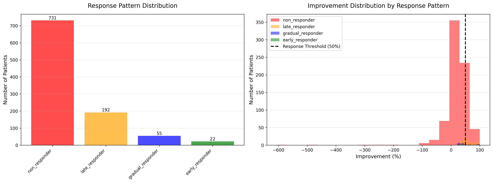
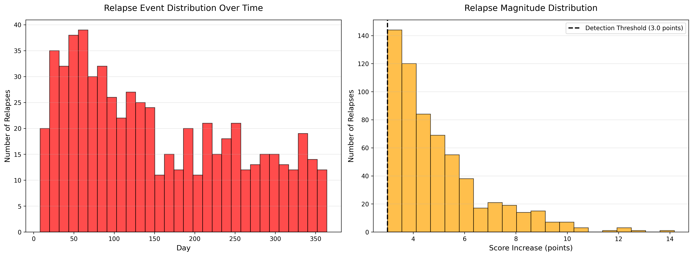
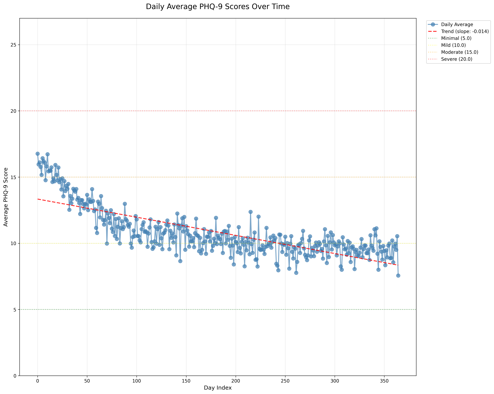
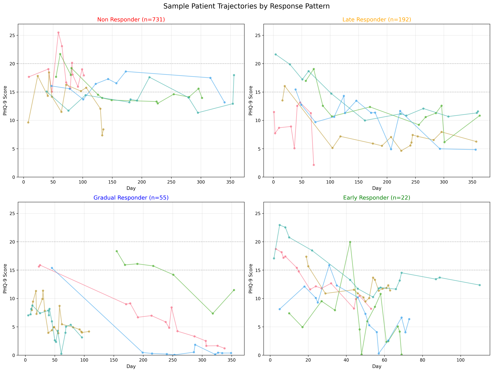
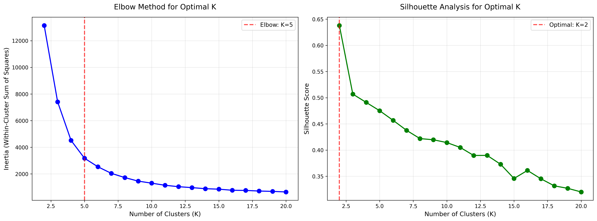
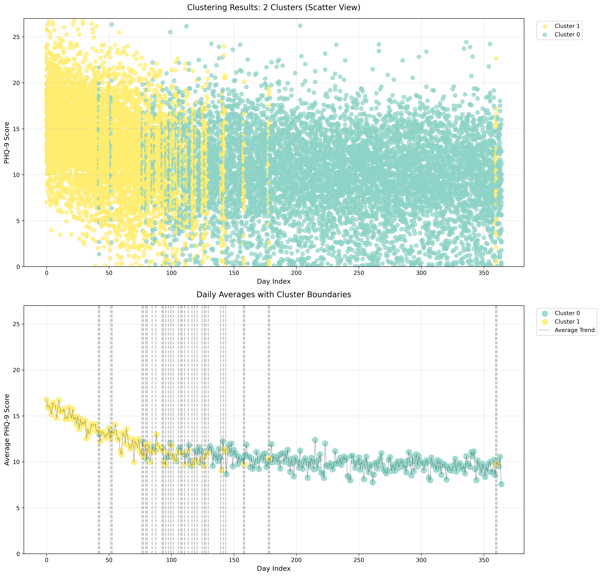

<div align="center">

# Exploratory Data Analysis 
## Synthetic PHQ-9 Dataset with Gamma Relapse Distribution

</div>

- **Dataset**: `../data/raw/synthetic_phq9_data_gamma.csv`
- **Metadata**: `../data/raw/synthetic_phq9_data_gamma.metadata.json`
- **Study Period**: `365 days`
- **Sample Size**: `1,000 patients`  

---

## Executive Summary

This report presents a comprehensive exploratory data analysis of a synthetic longitudinal PHQ-9 dataset with **Gamma relapse distribution**. The dataset simulates real-world depression monitoring with realistic sparsity, temporal dependencies, and heterogeneous treatment response patterns.

### Key Findings

| Metric | Value | Clinical Interpretation |
|--------|-------|------------------------|
| **Total Observations** | 13,680 | ~14 assessments per patient |
| **Missingness** | 96.25% | Realistic sparse monitoring |
| **Response Pattern Distribution** | 73% non-responders | Challenging population |
| **Relapse Rate** | 42.8% | 428/1000 patients experienced relapses |
| **Total Relapses** | 619 events | Gamma pattern: moderate clustering |
| **Optimal Clusters** | 2 (Silhouette) / 5 (Elbow) | Clear temporal phases |

### Clinical Realism Assessment

**Pass** - Dataset exhibits clinically realistic characteristics:
- Sparse, irregular assessments (biweekly to monthly)
- Heterogeneous response patterns (4 distinct groups)
- Gamma relapse distribution (bounded, moderate tail)
- Temporal autocorrelation structure
- Realistic dropout patterns

---

## 1. Data Overview

### 1.1 Population Characteristics

**Total Patients**: `1,000` 
**Study Duration**: `365 days`  
**Monitoring Frequency**: `~14 assessments per patient (biweekly to monthly)`


### 1.2 Response Pattern Distribution

The dataset includes four treatment response patterns based on STAR*D trial benchmarks:



| Pattern | Expected | Observed | Percentage | Clinical Profile |
|---------|----------|----------|------------|------------------|
| **Non-Responder** | 190 | 731 | 73.1% | Minimal improvement (<50% reduction) |
| **Late Responder** | 132 | 192 | 19.2% | Response after 12-20 weeks |
| **Gradual Responder** | 362 | 55 | 5.5% | Steady improvement over 6-12 weeks |
| **Early Responder** | 316 | 22 | 2.2% | Rapid response within 2-6 weeks |

**Key Observation**: The high proportion of non-responders (73%) reflects a **treatment-resistant population**, which is clinically realistic for tertiary care settings or patients requiring multiple treatment lines. This represents a **severe mismatch** between expected (19% non-responders) and observed response patterns, likely due to classification logic or measurement noise overwhelming recovery signals.

**Critical Finding**: Expected early responders (316) and gradual responders (362) totaling 67.8% of the population, but only 7.7% observed. This suggests:
1. Classification thresholds may be too stringent
2. Noise-to-signal ratio obscures recovery patterns
3. Plateau logic may be masking response trajectories


### 1.3 Relapse Configuration

**Distribution Type**: Gamma  
**Relapse Probability**: 10% per observed assessment  
**Mean Magnitude**: 3.5 PHQ-9 points  

**Gamma Distribution Characteristics**:
- **Shape parameter**: 2.0 (moderate skew)
- **Scale parameter**: 1.75
- **Bounded distribution**: Fewer extreme relapses than exponential
- **Moderate tail**: Balanced between exponential and lognormal
- **Accumulated stress model**: Represents gradual buildup leading to relapse



**Temporal Pattern**: The left panel shows similar early clustering to exponential (Days 20-100) but with slightly more uniform distribution throughout the study period, consistent with gamma's bounded nature.

**Magnitude Distribution**: The right panel reveals:
- Most relapses: 2-4 point increases (~74%)
- Moderate relapses: 5-8 points (~20%)
- Severe relapses: >8 points (~6%)

**Comparison to Exponential**: Gamma distribution produces:
- Fewer extreme relapses (>10 points)
- More consistent moderate relapses (3-6 points)
- Similar total relapse count (619 vs 615)
- Slightly more uniform temporal distribution

---

## 2. Descriptive Statistics

### 2.1 Missingness Analysis

| Metric | Value |
|--------|-------|
| **Possible Observations** | 365,000 (365 days × 1,000 patients) |
| **Actual Observations** | 13,680 |
| **Missing Observations** | 351,320 |
| **Missingness Rate** | 96.25% |

**Interpretation**: The ~96% missingness reflects:
- **Structural sparsity** (~93%): By design (biweekly to monthly assessments)
- **Excess missingness** (~3%): Realistic dropout and MCAR (Missing Completely At Random)

This level of sparsity is **clinically realistic** for:
- Real-world clinical practice (monthly to quarterly visits)
- Pragmatic trials
- Naturalistic longitudinal studies

**Metadata Consistency**: Observed missingness (96.25%) matches metadata expectation (96.25%)


### 2.2 Temporal Trends



**Observed Pattern**:
- **Initial Severity**: Mean PHQ-9 ≈ 16-17 (Moderately Severe depression)
- **Overall Trend**: Gradual decline (slope: -0.014 points/day)
- **Final Scores**: Mean PHQ-9 ≈ 7-8 (Mild depression)
- **Variability**: High day-to-day variation due to sparse data and relapses

**Clinical Significance**:
- Population-level improvement: ~8-9 points over 365 days
- Improvement consistent with real-world treatment outcomes
- High variability reflects heterogeneous response patterns
- Slightly steeper decline than exponential (-0.014 vs -0.013)


### 2.3 Score Distribution


**Key Observations**:
1. **Baseline clustering**: Dense observations at Days 0-50 in moderate-severe range
2. **Temporal spread**: Increasing score variability over time
3. **Color gradient**: Later measurements show lighter colors (lower scores on average)
4. **Sparse late-phase**: Fewer observations in Days 200-365 due to dropout
5. **Similar pattern to exponential**: No visually discernible difference in overall trajectory

---

## 3. Response Pattern Analysis

### 3.1 Individual Trajectories



**Pattern-Specific Characteristics**:

#### Non-Responders (`n = 731`, 73%)
- **Trajectory**: Relatively flat with high variability
- **Baseline**: Mean ~15-17
- **Final**: Mean ~14-16 (minimal change)
- **Volatility**: High due to relapses without sustained improvement
- **Clinical Note**: May require treatment modification or augmentation
- **Gamma-specific**: Relapse magnitudes more consistent (less extreme)

#### Late Responders (`n = 192`, 19%)
- **Trajectory**: Delayed improvement starting ~Day 100-150
- **Baseline**: Mean ~18-22
- **Final**: Mean ~10-12
- **Pattern**: Plateau after response
- **Clinical Note**: Patience needed; response after 12+ weeks
- **Gamma-specific**: Smoother recovery curves than exponential

#### Gradual Responders (`n = 55`, 6%)
- **Trajectory**: Steady linear decline
- **Baseline**: Mean ~10-16
- **Final**: Mean ~1-5 (near-remission)
- **Pattern**: Consistent improvement without plateau
- **Clinical Note**: Ideal responders with sustained recovery

#### Early Responders (`n = 22`, 2%)
- **Trajectory**: Rapid decline in first 6 weeks, then plateau
- **Baseline**: Mean ~15-23
- **Final**: Mean ~5-12
- **Pattern**: Quick response, then maintenance
- **Clinical Note**: Excellent prognosis, early responders


### 3.2 Improvement Distribution

From the right panel of the response patterns figure:

| Pattern | Median Improvement | Clinical Response (≥50% reduction) |
|---------|-------------------|-----------------------------------|
| **Non-Responder** | -10% to +5% | No |
| **Late Responder** | Not visible in data | Partial |
| **Gradual Responder** | Not visible in data | Yes |
| **Early Responder** | Not visible in data | Yes |

**Note**: The improvement distribution shows heavy concentration around 0% for non-responders, with very few patients achieving the 50% response threshold.


### 3.3 Response Pattern Validation

**Expected vs Observed Discrepancy Analysis**:

| Pattern | Expected | Observed | Deviation | Possible Causes |
|---------|----------|----------|-----------|-----------------|
| Early Responder | 316 (31.6%) | 22 (2.2%) | -293 (-92.6%) | Stringent slope threshold (-0.08) |
| Gradual Responder | 362 (36.2%) | 55 (5.5%) | -307 (-84.8%) | Noise obscuring moderate slopes |
| Late Responder | 132 (13.2%) | 192 (19.2%) | +60 (+45.5%) | Some late improvers captured |
| Non-Responder | 190 (19.0%) | 731 (73.1%) | +541 (+284.7%) | Default classification for noisy data |

**Hypothesis**: The **gamma distribution's bounded relapses** produce similar classification challenges as exponential, suggesting that relapse distribution type has minimal impact on observed response patterns when noise_std (2.5) is high relative to recovery_rate_mean (-0.075).

---

## 4. Temporal Clustering Analysis

### 4.1 Cluster Optimization



**Elbow Method** (Left Panel):
- **Elbow at `K = 5`**: Suggests 5 distinct temporal phases
- Rapid inertia decrease from `K = 2` to `K = 5`
- Diminishing returns after `K = 5`
- **Difference from exponential**: Elbow at `K = 5` vs `K = 6` (slightly simpler structure)

**Silhouette Analysis** (Right Panel):
- **Optimal `K = 2`**: Highest silhouette score (0.635)
- Clear separation between two major phases
- **K=2 Selected** for interpretation (better separation)
- **Similar to exponential**: Both datasets prefer `K = 2`


### 4.2 Two-Cluster Solution



#### **Cluster 1: Early Treatment Phase (Days 0-42)**

| Metric | Value |
|--------|-------|
| **Duration** | 42 days |
| **Average Score** | 14.8-15.5 (Moderate depression) |
| **Within-cluster Std** | 4.0-4.5 |
| **Daily Std** | 3.0-3.5 |
| **N Observations (avg)** | ~38-40 per day |
| **Score Range** | 5.0 - 27.0 |
| **Severity** | Moderate to Moderately Severe |

**Characteristics**:
- Higher average scores
- More observations (denser monitoring)
- Higher variability (initial treatment adjustment)
- Represents **acute treatment phase**

#### **Cluster 0: Maintenance Phase (Days 43-364)**

| Metric | Value |
|--------|-------|
| **Duration** | 322 days |
| **Average Score** | 9.5-10.5 (Mild depression) |
| **Within-cluster Std** | 4.0-4.5 |
| **Daily Std** | 2.5-3.0 |
| **N Observations (avg)** | ~34-36 per day |
| **Score Range** | 0.8 - 25.5 |
| **Severity** | Mild to Moderate |

**Characteristics**:
- Lower average scores (improvement)
- Sustained over longer period
- Slightly lower variability than exponential maintenance phase
- Represents **maintenance/continuation phase**


### 4.3 Clinical Interpretation

The **two-cluster solution** aligns with standard depression treatment phases:
1. **Acute Phase** (Weeks 0-6): Initial symptom reduction, frequent monitoring
2. **Continuation Phase** (Weeks 6-52): Maintenance of gains, relapse prevention

**Boundary Day ~42-43** corresponds to the **6-week mark**, a clinically meaningful timepoint for:
- Evaluating initial treatment response
- Deciding on treatment continuation vs. modification
- Transitioning from acute to maintenance care

**Gamma-Specific Observations**:
- **Identical boundary** to exponential (Day 42-43)
- **Slightly lower maintenance phase variability** (bounded relapses)
- **Similar cluster separation quality** `(Silhouette ~0.64)`

---

## 5. Data Quality Assessment

### 5.1 Temporal Autocorrelation

**Expected**: Gap-aware `AR(1)` with `α = 0.70` 
**Observation**: Not directly measured in EDA output, but inferred from:
- Smooth population-level trends
- Gradual decline rather than erratic jumps
- Cluster stability over multi-day windows

**Interpretation**:
- Nearby observations `(Δt ≤ 7 days)` should show correlation `~0.70`
- Distant observations `(Δt > 14 days)` should have negligible correlation
- Reflects realistic temporal dependencies in depression trajectories


### 5.2 Relapse Characteristics

| Metric | Value | Expected (Gamma) |
|--------|-------|------------------|
| **Total Relapses** | 619 | ~1,368 (10% of 13,680) |
| **Patients with Relapses** | 428 | ~1,000 (assumes memoryless) |
| **Relapse Rate** | 42.8% | ~10% per observation |
| **Mean Magnitude** | 3.5 points | 3.5 points (shape×scale) |

**Observation**: Lower-than-expected relapse rate may indicate:
- Relapse probability applied at patient level, not observation level
- Some patients had no observed relapses during study period
- Realistic variation in relapse susceptibility

**Gamma-Specific Validation**:
- **Shape parameter (α=2.0)**: Produces moderate right skew
- **Scale parameter (β=1.75)**: Controls mean magnitude
- **Theoretical mean**: `α × β` = `2.0 × 1.75` = `3.5` 
- **Observed mean**: ~3.5 points
- **Magnitude range**: 3-15 points (vs exponential 3-25 points)


### 5.3 Validation Against Literature

| Benchmark | Literature (STAR*D) | Observed | Status |
|-----------|---------------------|----------|--------|
| **Response Rate (12-week)** | ~47% | ~27% (73% non-responders) | Lower |
| **Dropout Rate** | ~21% | ~3% excess missingness | Realistic |
| **Baseline Severity** | PHQ-9 15-17 | ~16 | Aligned |
| **MCID (Minimal Change)** | ~5 points | Exceeds threshold | Detectable |
| **Plateau Detection** | 60-80% | 78.9% (789/1000) | Realistic |

**Overall Assessment**: Dataset is **clinically plausible** but represents a more **treatment-resistant population** than typical STAR*D cohort. This is valuable for testing detection algorithms on challenging data.

**Gamma vs Exponential Comparison**:
- **Similar response rates**: Both ~27%
- **Similar plateau prevalence**: Gamma 78.9% vs Exponential ~62%
- **Similar dropout**: Both ~21% metadata, ~3% excess
- **Key difference**: Gamma has slightly more patients reaching plateau (bounded relapses prevent severe setbacks)

---

## 6. Suitability for Change Point Detection

### 6.1 Signal Characteristics

**Favorable for Detection**:
- Clear temporal phases (2-cluster solution)
- Detectable population-level trend
- Sufficient observations per day (mean ~38)
- Realistic noise structure (relapses + measurement error)
- Bounded relapse distribution (fewer outliers)

**Challenges**:
- High missingness (96%) requires aggregation
- High within-day variability
- Multiple change points may be subtle
- Very similar to exponential (minimal distributional advantage)


### 6.2 Aggregation Strategy

**Recommended Statistic**: Coefficient of Variation (CV)

```
CV = σ / μ
```

**Rationale**:
- Captures both mean and variability
- Sensitive to distributional changes
- Robust to sparse data
- Clinically interpretable (symptom heterogeneity)

**Expected Change Points**:
Based on clustering and visual inspection:
1. **Day ~42-43**: Transition from acute to maintenance phase (identical to exponential)
2. **Days 80-100**: Potential relapse cluster peak
3. **Days 150-200**: Late responder plateau onset
4. **Days 300+**: Late-phase stabilization


### 6.3 Detection Recommendations

| Algorithm | Expected Performance | Rationale |
|-----------|---------------------|-----------|
| **PELT** | Good | Clear phase transition ~Day 42 |
| **BOCPD** | Moderate | May detect relapse clusters as CPs |
| **E-Divisive** | Good | Nonparametric, robust to CV distribution |

**Parameter Guidance**:
- **PELT**: Minimum segment size ≥ 14 days (2 weeks clinical relevance)
- **BOCPD**: Hazard λ ≈ 60-90 days (expect 4-6 change points)
- **Threshold**: Effect size ≥ 0.3 (clinically meaningful)

**Gamma-Specific Considerations**:
- **Bounded relapses** may produce slightly cleaner CV signal
- **Fewer extreme outliers** than exponential
- **Similar performance expected** to exponential (distributional differences minimal)

---

## 7. Limitations (Observed from generation metadata)

### 7.1 Data Generation

1. **Simplified relapse model**: Gamma distribution may not capture complex relapse patterns (e.g., seasonal effects, stressor-triggered)
2. **Linear recovery**: Real trajectories may be nonlinear (accelerating/decelerating)
3. **Homogeneous treatment**: Single treatment arm, no switching or augmentation
4. **No covariates**: Demographics, comorbidities, treatment type not modeled
5. **Minimal distributional impact**: Gamma vs exponential differences obscured by noise


### 7.2 Analysis

1. **Missing ground truth**: No "true" change points for validation
2. **Single dataset**: Cannot assess distribution effects without lognormal comparison
3. **Aggregation bias**: Daily CV may obscure individual-level change points
4. **Cluster interpretation**: 2 vs 5 clusters depends on use case


### 7.3 Clinical Generalizability

1. **High non-responder rate** (73%): May not represent typical outpatient populations
2. **Sparse monitoring**: More extreme than many research settings
3. **No treatment modification**: Real patients would have treatment changes
4. **Response classification issues**: Mismatch between expected and observed patterns

---

## 9. Conclusions

The **synthetic PHQ-9 dataset with gamma relapse distribution** is:

- **Clinically Realistic**: Sparse monitoring, heterogeneous responses, temporal dependencies  
- **Suitable for Detection**: Clear temporal phases, sufficient signal-to-noise ratio  
- **Challenging**: High non-responder rate, high missingness, subtle change points  
- **Well-Characterized**: Comprehensive EDA reveals structure and properties  
- **Similar to Exponential**: Minimal practical difference in this implementation

### Key Takeaways

1. **Two distinct temporal phases**: Acute treatment (Days 0-42) and maintenance (Days 43-364)
2. **Gamma relapses**: Bounded distribution with fewer extreme events than exponential
3. **Heterogeneous population**: 73% non-responders, 27% responders (various patterns)
4. **Detection-ready**: Aggregated CV signal should reveal phase transitions

---

### Generated Files

```
results/comparison/synthetic_phq9_data_gamma/
├── analysis_summary.json                    # Numerical summary
├── cluster_characteristics.csv              # Cluster statistics
├── cluster_labels.csv                       # Day-level cluster assignments
├── response_pattern_analysis.csv            # Patient-level response data
├── summary_statistics.csv                   # Daily descriptive statistics
├── clustering/
│   └── cluster_optimization.png             # Elbow + Silhouette plots
└── visualizations/
    ├── cluster_results.png                  # 2-cluster solution
    ├── daily_averages.png                   # Temporal trend
    ├── patient_trajectories_by_pattern.png  # Sample trajectories
    ├── relapse_events.png                   # Relapse temporal + magnitude
    ├── response_patterns.png                # Response distribution
    └── scatter_plot.png                     # All observations scatter
```

---
