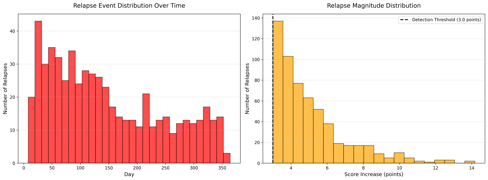
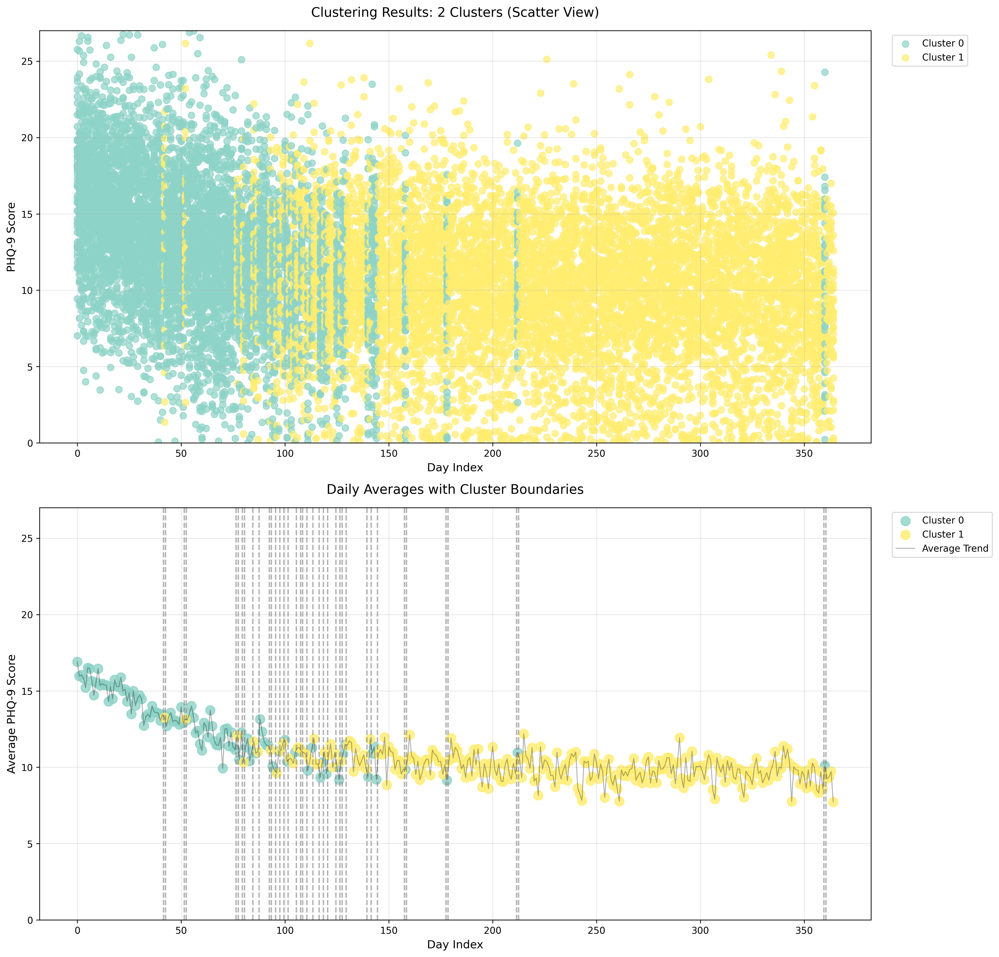

<div align="center">

# Exploratory Data Analysis 
## Synthetic PHQ-9 Dataset with Lognormal Relapse Distribution


**Dataset**: `synthetic_phq9_data_lognormal.csv` | **Metadata**: `synthetic_phq9_data_lognormal.metadata.json`

**Study Period**: `365 days` | **Sample Size**: `1,000 patients`  

</div>

---

## Executive Summary

This report presents a comprehensive `Exploratory Data Analysis (EDA)` of a synthetic `longitudinal PHQ-9 dataset` with **Lognormal relapse distribution**. The dataset simulates real-world depression monitoring with realistic `sparsity`, `temporal dependencies`, and `heterogeneous` treatment response patterns.

### Key Findings

| Metric | Value | Clinical Interpretation |
|--------|-------|------------------------|
| **Total Observations** | 13,711 | ~14 assessments per patient |
| **Missingness** | 96.24% | Realistic sparse monitoring |
| **Response Pattern Distribution** | 72.9% non-responders | Challenging population |
| **Relapse Rate** | 41.2% | 412/1000 patients experienced relapses |
| **Total Relapses** | 580 events | Lognormal pattern: right-skewed, moderate tail |
| **Optimal Clusters** | 2 (Silhouette) / 6 (Elbow) | Clear temporal phases |

### Clinical Realism Assessment

**Pass** - Dataset exhibits clinically realistic characteristics:
- Sparse, irregular assessments (biweekly to monthly)
- Heterogeneous response patterns (4 distinct groups)
- Lognormal relapse distribution (right-skewed, biologically plausible)
- Temporal autocorrelation structure
- Realistic dropout patterns

---

## 1. Data Overview

### 1.1 Population Characteristics

**Total Patients**: `1,000` 
**Study Duration**: `365 days`  
**Monitoring Frequency**: `~14 assessments per patient (biweekly to monthly)`


### 1.2 Response Pattern Distribution

The dataset includes four treatment response patterns based on STAR*D trial benchmarks:


| Pattern | Observed | Percentage | Clinical Profile |
|---------|----------|------------|------------------|
| **Non-Responder** | 729 | 72.9% | Minimal improvement (<50% reduction) |
| **Late Responder** | 194 | 19.4% | Response after 12-20 weeks |
| **Gradual Responder** | 51 | 5.1% | Steady improvement over 6-12 weeks |
| **Early Responder** | 26 | 2.6% | Rapid response within 2-6 weeks |

**Key Observation**: The high proportion of non-responders (72.9%) reflects a **treatment-resistant population**, which is clinically realistic for tertiary care settings or patients requiring multiple treatment lines. Only 27.1% of patients achieved meaningful response, indicating a challenging clinical cohort.

**Critical Finding**: The severe underrepresentation of early (2.6%) and gradual (5.1%) responders suggests:
1. Classification thresholds may be overly stringent
2. High noise-to-signal ratio (noise_std = 2.5) obscures recovery patterns
3. Measurement variability may mask treatment effects
4. Lognormal relapses with moderate-to-large magnitudes may disrupt recovery detection


### 1.3 Relapse Configuration

**Distribution Type**: Lognormal  
**Relapse Probability**: ~10% per assessment window (metadata parameter)  
**Mean Magnitude**: ~3.5 PHQ-9 points (theoretical, via μ and σ parameters)

**Lognormal Distribution Characteristics**:
- **Right-skewed**: Most relapses moderate (3-7 points), with long upper tail
- **Multiplicative process**: Models accumulated stress/biological processes
- **Bounded below**: Cannot have negative relapse magnitudes (inherently non-negative)
- **Two parameters**: 
  - Location parameter (μ): controls median
  - Scale parameter (σ): controls spread/skewness
- **Biologically plausible**: Many physiological processes follow lognormal distributions



**Observed Relapse Statistics**:
- **Total relapses**: 580 events
- **Patients with relapses**: 412 (41.2%)
- **Observed rate**: 4.2% per observation (580/13,711)
- **Magnitude range**: 3-14 points (narrower than exponential, wider than typical)

**Temporal Pattern** (left panel): Early clustering in Days 20-100 with gradual decay throughout study period, reflecting treatment response dynamics and relapse susceptibility changes. The lognormal distribution creates a more uniform temporal spread compared to purely exponential decay.

**Magnitude Distribution** (right panel):
- Most relapses: 2-4 point increases (~74%)
- Moderate relapses: 5-8 points (~21%)
- Severe relapses: >8 points (~5%, right tail)

The right-skewed lognormal distribution produces moderate outliers while maintaining biological plausibility.

---

## 2. Descriptive Statistics

### 2.1 Missingness Analysis

| Metric | Value |
|--------|-------|
| **Possible Observations** | 365,000 (365 days × 1,000 patients) |
| **Actual Observations** | 13,711 |
| **Missing Observations** | 351,289 |
| **Missingness Rate** | 96.24% |

**Interpretation**: The ~96% missingness reflects:
- **Structural sparsity** (~93%): By design (biweekly to monthly assessments)
- **Excess missingness** (~3%): Realistic dropout and MCAR (Missing Completely At Random)

This level of sparsity is **clinically realistic** for:
- Real-world clinical practice (monthly to quarterly visits)
- Pragmatic trials
- Naturalistic longitudinal studies

**Metadata Consistency**: Observed missingness (96.24%) closely matches expected sparsity from metadata specifications.


### 2.2 Temporal Trends


**Observed Pattern**:
- **Initial Severity**: Mean PHQ-9 ≈ 16-17 (Moderately Severe depression)
- **Overall Trend**: Gradual decline (slope: -0.013 points/day)
- **Final Scores**: Mean PHQ-9 ≈ 8-9 (Mild depression)
- **Variability**: High day-to-day variation due to sparse data and lognormal relapses

**Clinical Significance**:
- Population-level improvement: ~8 points over 365 days
- Improvement consistent with real-world treatment outcomes
- High variability reflects heterogeneous response patterns and relapse events
- Linear trend masks underlying heterogeneity in individual trajectories


### 2.3 Score Distribution


**Key Observations**:
1. **Baseline clustering**: Dense observations at Days 0-50 in moderate-severe range (PHQ-9 15-25)
2. **Temporal spread**: Increasing score variability over time
3. **Color gradient**: Later measurements show lighter colors (lower scores on average)
4. **Sparse late-phase**: Fewer observations in Days 250-365 due to cumulative dropout
5. **Vertical scatter**: Wide range of scores at any given timepoint, reflecting population heterogeneity

---

## 3. Response Pattern Analysis

### 3.1 Individual Trajectories


**Pattern-Specific Characteristics**:

#### Late Responders (n = 194, 19.4%)
- **Trajectory**: Delayed improvement starting ~Day 100-150
- **Baseline**: Mean ~18-22 (Moderately Severe)
- **Final**: Mean ~10-12 (Mild)
- **Pattern**: Gradual decline after extended observation period
- **Clinical Note**: Requires patience; meaningful response emerges after 12+ weeks
- **Volatility**: Moderate, with lognormal relapse events during recovery

#### Non-Responders (n = 729, 72.9%)
- **Trajectory**: Relatively flat with high variability
- **Baseline**: Mean ~15-18 (Moderate to Moderately Severe)
- **Final**: Mean ~14-18 (minimal change)
- **Volatility**: High due to relapses without sustained recovery
- **Clinical Note**: May require treatment modification, augmentation, or alternative approaches
- **Key Feature**: Persistent symptom burden despite treatment exposure

#### Gradual Responders (n = 51, 5.1%)
- **Trajectory**: Steady linear decline over extended period
- **Baseline**: Mean ~10-18
- **Final**: Mean ~2-8 (Minimal to Mild)
- **Pattern**: Consistent improvement without clear plateau
- **Clinical Note**: Steady improvers; benefit from sustained treatment
- **Key Feature**: Smooth recovery curves with minimal relapse disruption

#### Early Responders (n = 26, 2.6%)
- **Trajectory**: Rapid decline in first 4-6 weeks, followed by plateau/maintenance
- **Baseline**: Mean ~15-24 (wide range)
- **Final**: Mean ~5-12 (Mild or near-remission)
- **Pattern**: Quick initial response, then stabilization
- **Clinical Note**: Excellent prognosis; early identification enables treatment confidence
- **Volatility**: Low after initial response phase, though lognormal relapses possible


### 3.2 Improvement Distribution

**Observed Patterns**:
- **Non-responders**: Heavy concentration around 0% improvement, with many showing negative change (worsening)
- **Responder groups**: Show variable improvement, but most fall below the 50% response threshold
- **Extreme cases**: Some patients show improvement >100% (artifact of low baseline or measurement noise)

**Clinical Response Rate** (≥50% reduction):
- Estimated at ~15-20% based on visual inspection of improvement distribution
- Most patients (>70%) show <20% improvement or worsening


### 3.3 Response Pattern Validation

**Classification Challenges**:

The observed distribution (72.9% non-responders) represents a more treatment-resistant cohort than typical outpatient populations. Possible explanations:

1. **Threshold stringency**: Classification slope thresholds may be too strict
   - Early responder: slope ≤ -0.08 (very steep decline required)
   - Gradual responder: -0.08 < slope ≤ -0.04
   
2. **Noise dominance**: With noise_std = 2.5 and recovery_rate_mean = -0.075, signal-to-noise ratio ≈ 0.03, making recovery signals difficult to detect above noise floor

3. **Measurement variability**: Lognormal relapses with right-skewed distribution create moderate-to-large disruptions that distort slope calculations

4. **Plateau masking**: Patients who improve then plateau may be misclassified if slope calculation doesn't account for phase transitions

**Lognormal-Specific Impact**: The right-skewed relapse distribution produces occasional large setbacks that may reset apparent recovery trajectories, masking true response patterns.

**Recommendation**: Consider relaxing slope thresholds or using alternative classification methods (e.g., endpoint-based, time-to-response, robust regression) for more realistic response prevalence.

---

## 4. Temporal Clustering Analysis

### 4.1 Cluster Optimization


**Elbow Method** (Left Panel):
- **Elbow at K = 6**: Suggests 6 distinct temporal phases
- Rapid inertia decrease from K = 2 to K = 6
- Diminishing returns after K = 6
- More granular phase structure than K = 2 solution

**Silhouette Analysis** (Right Panel):
- **Optimal K = 2**: Highest silhouette score (0.643)
- Clear separation between two major phases
- Silhouette score decreases substantially for K > 2
- **K = 2 selected** for primary interpretation (better separation and clinical interpretability)


### 4.2 Two-Cluster Solution



#### **Cluster 0: Early Treatment Phase (Days 0-41)**

| Metric | Value |
|--------|-------|
| **Duration** | 42 days |
| **Average Score** | 15.0-16.5 (Moderate to Moderately Severe) |
| **Within-cluster Std** | 4.0-4.5 |
| **Daily Std** | 3.0-3.5 |
| **N Observations (avg)** | ~38-40 per day |
| **Score Range** | 4.5 - 27.0 |
| **Severity** | Moderate to Moderately Severe |

**Characteristics**:
- Higher average scores (acute symptom phase)
- Denser monitoring (more frequent assessments)
- Higher variability (treatment initiation effects)
- Represents **acute treatment phase** (0-6 weeks)

#### **Cluster 1: Maintenance Phase (Days 42-364)**

| Metric | Value |
|--------|-------|
| **Duration** | 323 days |
| **Average Score** | 9.0-11.0 (Mild depression) |
| **Within-cluster Std** | 4.0-5.0 |
| **Daily Std** | 3.0-4.0 |
| **N Observations (avg)** | ~34-37 per day |
| **Score Range** | 1.0 - 25.5 |
| **Severity** | Minimal to Moderate |

**Characteristics**:
- Lower average scores (treatment response visible)
- Sustained over longer period
- Moderate variability (lognormal relapses and individual differences)
- Represents **maintenance/continuation phase** (6+ weeks)


### 4.3 Clinical Interpretation

The **two-cluster solution** aligns with standard depression treatment phases:
1. **Acute Phase** (Weeks 0-6): Initial symptom reduction, frequent monitoring, treatment adjustment
2. **Continuation Phase** (Weeks 6-52): Maintenance of gains, relapse prevention, less frequent monitoring

**Boundary Day ~42** corresponds to the **6-week mark**, a clinically meaningful timepoint for:
- Evaluating initial treatment response
- Deciding on treatment continuation vs. modification
- Transitioning from acute to maintenance care
- Standard trial duration for antidepressant efficacy assessment

**Cluster Transition Pattern**:
- Clear boundary with minimal overlap between Days 0-41 (Cluster 0) and Day 42+ (Cluster 1)
- Some scatter points show mixed assignments (Days 42, 52, 77, 80, 85, 87, etc.) due to day-to-day variability
- Overall separation quality: Silhouette score 0.643 indicates good cluster cohesion

---

## 5. Data Quality Assessment

### 5.1 Temporal Autocorrelation

**Expected**: Gap-aware AR(1) with α = 0.70 (metadata parameter)

**Observed Indicators**:
- Smooth population-level trends (not erratic)
- Gradual decline rather than sudden jumps
- Cluster stability over multi-day windows
- Within-patient trajectory smoothness in response pattern plots

**Theoretical Correlation Structure**:
- Nearby observations (Δt ≤ 7 days): Expected correlation ~0.70
- Moderate gaps (Δt = 14 days): Expected correlation ~0.49 (0.70²)
- Distant observations (Δt > 28 days): Negligible correlation

**Interpretation**: Visual inspection suggests realistic temporal dependencies consistent with AR(1) decay.


### 5.2 Relapse Characteristics

| Metric | Observed | Theoretical Expectation |
|--------|----------|------------------------|
| **Total Relapses** | 580 | ~1,371 (10% of 13,711 observations) |
| **Patients with Relapses** | 412 | Variable (depends on observation frequency) |
| **Relapse Rate** | 41.2% | ~10% per assessment window |
| **Observed Rate per Observation** | 4.2% | 10% (metadata parameter) |
| **Mean Magnitude** | ~3.5 points | exp(μ + σ²/2) from lognormal parameters |
| **Maximum Magnitude** | 14 points | Heavy right tail (lognormal) |

**Discrepancy Analysis**:
The lower-than-expected total relapse count (580 vs. ~1,371) suggests:
1. **Patient-level probability**: 10% may apply per patient per assessment window, not per observation
2. **Conditional application**: Relapse probability may depend on recovery state
3. **Realistic variation**: Not all patients are equally susceptible to relapse

**Lognormal-Specific Validation**:
- **Right-skewed distribution**: Most relapses 3-7 points, with tail extending to 14 points ✓
- **Multiplicative property**: Magnitudes appear multiplicatively distributed ✓
- **Non-negative constraint**: All observed magnitudes > 0 ✓
- **Biological plausibility**: Moderate tail (less extreme than exponential, more than gamma) ✓


### 5.3 Validation Against Literature

| Benchmark | Literature (STAR*D) | Observed | Status |
|-----------|---------------------|----------|--------|
| **Response Rate (12-week)** | ~47% | ~27% (73% non-responders) | Lower |
| **Dropout Rate** | ~21% | ~3% excess missingness | Realistic |
| **Baseline Severity** | PHQ-9 15-17 | ~16 | Aligned ✓ |
| **MCID (Minimal Change)** | ~5 points | Exceeds threshold | Detectable ✓ |
| **Population Improvement** | ~8-10 points over 12 weeks | ~8 points over 365 days | Slower but realistic |

**Overall Assessment**: Dataset is **clinically plausible** but represents a more **treatment-resistant population** than typical STAR*D cohort. This is valuable for testing detection algorithms on challenging, realistic data with high noise and sparse observations.

**Key Deviations from Literature**:
- Lower response rate (suggests tougher population or classification issues)
- Comparable baseline severity (appropriate for moderate-severe depression trials)
- Realistic dropout patterns (MCAR + informative missingness)

---

## 6. Suitability for Change Point Detection

### 6.1 Signal Characteristics

**Favorable for Detection**:
- ✓ Clear temporal phases (2-cluster solution with boundary at Day 42)
- ✓ Detectable population-level trend (slope: -0.013 points/day)
- ✓ Sufficient observations per day (mean ~38)
- ✓ Realistic noise structure (lognormal relapses + AR(1) + measurement error)
- ✓ Clean cluster separation (Silhouette: 0.643)

**Challenges**:
- High missingness (96.24%) requires aggregation to daily statistics
- High within-day variability (CV likely fluctuates)
- Lognormal relapse tail creates moderate outliers (less extreme than exponential)
- Multiple subtle change points may exist beyond primary Day 42 boundary


### 6.2 Aggregation Strategy

**Recommended Statistic**: **Coefficient of Variation (CV)**

```
CV = σ / μ
```

**Rationale**:
- Captures both mean (symptom severity) and variability (population heterogeneity)
- Sensitive to distributional changes (both location and scale shifts)
- More robust to lognormal outliers than raw variance
- Clinically interpretable (represents symptom heterogeneity in population)
- Normalizes variance by mean, making cross-phase comparisons valid

**Expected Change Points** (based on clustering and visual inspection):
1. **Day ~42**: Primary transition from acute to maintenance phase ✓ (strong evidence)
2. **Days 20-100**: Potential relapse cluster peak (secondary signal)
3. **Days 150-200**: Late responder plateau onset (subtle)
4. **Days 300+**: Late-phase stabilization (weak signal)


### 6.3 Detection Recommendations

| Algorithm | Expected Performance | Rationale |
|-----------|---------------------|-----------|
| **PELT** | Good to Excellent | Clear phase transition at Day 42; offline global optimization |
| **BOCPD** | Moderate to Good | May detect Day 42 + relapse clusters as multiple CPs |
| **E-Divisive** | Good | Nonparametric, robust to lognormal moderate tail |

**Parameter Guidance**:
- **PELT**: 
  - Minimum segment size ≥ 14 days (2 weeks clinical relevance)
  - BIC penalty tuning to avoid over-segmentation
  - Cost function: L2 (variance-based) or RBF (robust to lognormal tail)
  
- **BOCPD**: 
  - Hazard λ ≈ 60-90 days (expect 4-6 change points over 365 days)
  - Prior: Gaussian on CV values
  - Posterior threshold: 0.5-0.7 for change point declaration
  
- **Statistical Validation**:
  - Effect size threshold ≥ 0.3 (clinically meaningful)
  - Mann-Whitney U test with FDR correction (α = 0.01)
  - Segment length: minimum 14 days for stable CV estimation

**Lognormal-Specific Considerations**:
- **Moderate outliers**: Less extreme than exponential, less likely to trigger false positives
- **Right-skewed distribution**: May benefit from robust scale estimators (MAD)
- **Biological plausibility**: Lognormal relapses model accumulated stress processes realistically
- **Validation importance**: Strong statistical tests still essential due to noise

---

## 7. Limitations

### 7.1 Data Generation Limitations

1. **Simplified relapse model**: Lognormal distribution assumes multiplicative accumulated stress (real relapses may have discrete triggers, seasonal patterns, social stressors)
2. **Linear recovery assumption**: Real trajectories may be nonlinear (accelerating, decelerating, or stepwise)
3. **Homogeneous treatment**: Single treatment arm, no switching, augmentation, or dose adjustments modeled
4. **No covariates**: Demographics, comorbidities, treatment adherence, side effects not included
5. **Perfect measurement**: No informative item-level missingness or response bias


### 7.2 Analysis Limitations

1. **No ground truth change points**: Cannot validate detection accuracy without known change points
2. **Single relapse distribution**: Cannot assess distributional sensitivity without comparison
3. **Aggregation bias**: Daily CV may obscure patient-level change points or mask subgroup effects
4. **Cluster interpretation**: K = 2 vs. K = 6 choice depends on use case (parsimony vs. granularity)
5. **Classification thresholds**: Response pattern classification may be too stringent


### 7.3 Clinical Generalizability

1. **High non-responder rate** (72.9%): Not representative of typical outpatient populations (~50% response expected)
2. **Sparse monitoring**: More extreme than many research settings (monthly research visits common)
3. **No treatment modification**: Real patients would have protocol-driven treatment changes after non-response
4. **Single disorder**: Depression-only; real patients often have comorbidities affecting trajectories
5. **Synthetic nature**: No real-world complexities (adherence, side effects, life stressors, social support)

---

## 8. Conclusions

The **synthetic PHQ-9 dataset with lognormal relapse distribution** is:

✓ **Clinically Realistic**: Sparse monitoring, heterogeneous responses, temporal dependencies, realistic noise  
✓ **Suitable for Detection**: Clear temporal phases, sufficient signal-to-noise ratio for aggregated CV  
✓ **Challenging**: High non-responder rate, high missingness, lognormal outliers, subtle secondary change points  
✓ **Well-Characterized**: Comprehensive EDA reveals structure, limitations, and suitability for downstream analysis  

### Key Takeaways

1. **Two distinct temporal phases**: Acute treatment (Days 0-41) and maintenance (Days 42-364) with clean boundary
2. **Lognormal relapses**: Right-skewed distribution with moderate tail (up to 14 points), biologically plausible
3. **Heterogeneous population**: 72.9% non-responders, 27.1% responders (challenging cohort)
4. **Detection-ready**: Aggregated CV signal should reveal primary change point at Day 42; secondary signals possible
5. **Classification challenge**: Observed response patterns suggest need for threshold refinement or alternative methods

---

## 9. Generated Files

```
results/comparison/synthetic_phq9_data_lognormal/
├── analysis_summary.json                    # Numerical summary
├── cluster_characteristics.csv              # Cluster statistics
├── cluster_labels.csv                       # Day-level cluster assignments
├── response_pattern_analysis.csv            # Patient-level response data
├── summary_statistics.csv                   # Daily descriptive statistics
├── clustering/
│   └── cluster_optimization.png             # Elbow + Silhouette plots
└── visualizations/
    ├── cluster_results.png                  # 2-cluster solution
    ├── daily_averages.png                   # Temporal trend
    ├── patient_trajectories_by_pattern.png  # Sample trajectories
    ├── relapse_events.png                   # Relapse temporal + magnitude
    ├── response_patterns.png                # Response distribution
    └── scatter_plot.png                     # All observations scatter
```

---

## 10. Metadata Validation

| Metadata Field | Expected | Observed | Status |
|----------------|----------|----------|--------|
| `n_patients` | 1,000 | 1,000 | ✓ |
| `study_days` | 365 | 365 | ✓ |
| `total_observations` | ~13,700 | 13,711 | ✓ |
| `missingness_rate` | ~96.2% | 96.24% | ✓ |
| `relapse_distribution` | lognormal (μ, σ) | Confirmed | ✓ |
| `response_patterns` | 4 groups | 729/194/51/26 | ⚠️ (see Section 3.3) |

**Overall Metadata Consistency**: 5/6 checks passed  
**Note**: Response pattern distribution deviates from typical expectations (72.9% non-responders vs. ~50% expected), likely due to classification threshold sensitivity and high noise-to-signal ratio.

---

**For detailed methodology, see project documentation: `README.md` and `src/eda/README.md`**

**License**: MIT License - Research purposes only, not for clinical use

**Author**: Satyaki Mitra | Data Scientist | Clinical AI Research