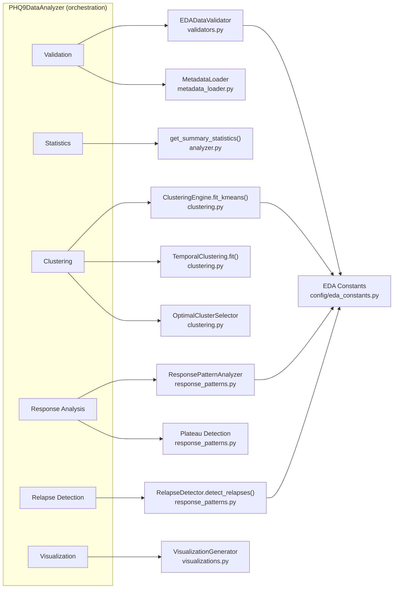

# PHQ-9 Exploratory Data Analysis (EDA) Module

## 🎯 Overview

This module provides a clinically grounded, reproducible exploratory data analysis (EDA) pipeline for longitudinal PHQ-9 datasets.

It is designed to validate, characterize, and compare PHQ-9 time-series before any modeling or change-point detection is applied.

> **Scope note**: *This module performs EDA only. It does not train predictive models or perform causal inference.*

---

## ✅ Key Capabilities

- **Metadata-aware validation**: Automatically validates observed data against generation metadata
- **Response pattern analysis**: Classifies patients into early / gradual / late responders and non-responders
- **Relapse detection**: Identifies clinically meaningful symptom rebounds
- **Advanced clustering**: KMeans and temporal-aware clustering (with extensible support for hierarchical methods)
- **Multi-dataset comparison**: Quantitative ranking of relapse distributions for pipeline selection
- **Rich visualizations**: Trajectories, clusters, response patterns, relapses, and comparison dashboards

---

## 🧪 Methods – Exploratory Analysis

| Stage | Method | Unit of Analysis | Description | Output | 
|-------|--------|------------------|-------------|--------|
| Data validation | Metadata-aware checks | Dataset | Shape, missingness, score bounds, metadata consistency | Validation report | 
| Summary statistics | Descriptive statistics | Day × Patient | Mean, variance, missingness, severity bands | summary_statistics.csv |
| Clustering | KMeans / Agglomerative / Temporal | Day | Groups days by severity and stability | cluster_labels.csv |
| Cluster evaluation | Silhouette, inertia | Cluster set | Quantifies cluster separability and stability | cluster_characteristics.csv |
| Response pattern analysis | Trajectory slope & improvement | Patient | Classifies responders vs non-responders | response_pattern_analysis.csv |
| Plateau detection | Variance + slope windows | Patient | Detects symptom stabilization phases | Pattern annotations | 
| Relapse detection | Thresholded score increases | Patient | Identifies clinically meaningful rebounds | Relapse summary |
| Visualization | Multi-view plotting | Dataset | Trajectories, clusters, relapses, patterns | PNG figures |
| Distribution comparison | Weighted scoring | Dataset | Ranks datasets for downstream use | dataset_comparison.csv |

> *This table corresponds directly to the implementation in src/eda/analyzer.py and related modules.*

### EDA Methods → Implementation Mapping



---

## 🔒 Design Guarantees & Non-Goals

### Design Guarantees

| Guarantee | Explanation |
|-----------|-------------|
| No label leakage | Analysis uses only observed PHQ-9 scores |
| No future conditioning | Temporal analyses respect time ordering |
| Metadata-bounded | Observed statistics are validated against generation parameters |
| Clinically grounded thresholds | All cutoffs sourced from literature or documented constants |
| Reproducible | Fully deterministic given config and random seeds |
| Descriptive only | Outputs are exploratory, not predictive |


### Explicit Non-Goals

| Non-Goal | Clarification |
|----------|---------------|
| Predictive modeling | No forecasting or outcome prediction |
| Causal inference | No treatment effect estimation |
| Clinical decision support | Not intended for patient-level decisions |
| Model training | No ML models are fit |
| Statistical hypothesis testing | No p-values or inferential claims | 
| Real-world clinical validation | Synthetic / research-grade analysis only |

> *These constraints are enforced by design and documented to prevent misuse.*

---

## 🚀 Quick Start

### Run EDA on a Single Dataset
```bash
python scripts/run_eda.py \
    --data data/raw/synthetic_phq9_data_exponential.csv
```

### Skip Cluster Optimization

```bash
python scripts/run_eda.py \
    --data data/raw/synthetic_phq9_data_gamma.csv \
    --n-clusters 5
```

### Enable Temporal-Aware Clustering

```bash
python scripts/run_eda.py \
    --data data/raw/synthetic_phq9_data_lognormal.csv \
    --temporal
```

### Multi-Dataset Distribution Comparison: 

Compare multiple relapse distributions and select the most realistic dataset as follows:

```bash
python scripts/compare_distributions.py \
    --data-dir data/raw \
    --output-dir results/comparison \
    --patterns exponential gamma lognormal
```

### Example Console Output

```text

🏆 RECOMMENDATION
Best dataset: synthetic_phq9_data_exponential
Composite score: 87.45 / 100

Use this dataset for downstream change-point detection:
  data/raw/synthetic_phq9_data_exponential.csv
```

### Metadata Integration

If a .metadata.json sidecar exists, it is automatically loaded and used for validation as follows:

```python

from config.eda_config import EDAConfig
from src.eda.analyzer import PHQ9DataAnalyzer

config   = EDAConfig(load_metadata             = True,
                     validate_against_metadata = True,
                    )

analyzer = PHQ9DataAnalyzer(config)
analyzer.load_data()
```

**Metadata Validation Includes**
- Number of patients and study duration
- Missingness rate consistency
- Response pattern distribution consistency
- Plateau and relapse statistics (if present)

---

## 📈 Response Pattern Analysis

Patients are classified into four clinically interpretable categories:

- `early_responder`
- `gradual_responder`
- `late_responder`
- `non_responder`

```python
response_df = analyzer.analyze_response_patterns()
```

##### Output Columns:

- patient_id
- baseline
- final_score
- improvement
- improvement_pct
- slope
- r_squared
- response_pattern
- plateau_detected
- plateau_start_day

##### Classification Logic (from eda_constants.py):

- Early responder: slope ≤ −0.08
- Gradual responder: −0.08 < slope ≤ −0.04
- Late responder: −0.04 < slope ≤ −0.02
- Non-responder: <20% improvement OR slope > −0.02

##### Metadata Comparison (if available)

- Observed response distributions are compared against expected metadata values and summarized with an overall match score.

---

## 🔄 Relapse Detection

Relapses are defined as sudden clinically meaningful score increases.

```python
relapse_results = analyzer.detect_relapses()
```

### Example Output Structure:

```json
{
  total_relapses: 1247,
  patients_with_relapses: 623,
  relapse_rate: 0.623,
  mean_relapses_per_patient: 1.25,
  relapse_details: [
    {patient_id: "12", day: 120, magnitude: 6.3}
  ]
}
```

### Detection Parameters

Defined centrally in eda_constants.py:
- Score increase threshold: 3.0 points
- Minimum gap: 7 days
- Maximum gap: 30 days

---

## 🧩 Clustering & Temporal Segmentation

Clustering is performed on days, not patients.

### Supported approaches:
- KMeans (default)
- Agglomerative clustering
- Temporal-aware clustering (penalizes distant days)

### Cluster quality is evaluated using:
- Inertia
- Silhouette score
- Clinical interpretability thresholds

---

## 📊 Distribution Comparison & Ranking

Datasets are ranked using a weighted composite score.

### Scoring Dimensions

| Metric | Weight | Description |
|--------|--------|-------------|
| Temporal stability | 35% | Fewer erratic cluster transitions |
| Clinical realism | 30% | Severity distribution plausibility |
| Statistical quality | 20% | Outliers, variance, skew | 
| Metadata consistency | 15% | Observed vs expected alignment |

### Code Example:

```python
from src.eda.distribution_comparator import DistributionComparator

comparator    = DistributionComparator()
comparison_df = comparator.compare_datasets(eda_results_list)
```

---

## 🖼️ Visualizations Generated

- Scatter of all PHQ-9 scores
- Daily average trends with severity bands
- Cluster optimization (elbow + silhouette)
- Clustered timelines
- Response pattern distributions
- Sample patient trajectories by pattern
- Relapse timing and magnitude
- Cross-dataset comparison dashboards
- Composite ranking plots

> All visualizations are controlled by constants in `eda_constants.py`

---

## 📁 Output Structure

```plaintext
results/eda/
├── summary_statistics.csv
├── cluster_characteristics.csv
├── cluster_labels.csv
├── response_pattern_analysis.csv
├── analysis_summary.json
├── clustering/
│   └── cluster_optimization.png
└── visualizations/
    ├── scatter_plot.png
    ├── daily_averages.png
    ├── cluster_results.png
    ├── response_patterns.png
    ├── patient_trajectories_by_pattern.png
    └── relapse_events.png

results/comparison/
├── synthetic_phq9_data_exponential/
├── synthetic_phq9_data_gamma/
├── synthetic_phq9_data_lognormal/
└── comparison_summary/
    ├── dataset_comparison.csv
    ├── comparison_report.json
    ├── distribution_comparison.png
    └── composite_scores.png
```

---

## ⚙️ Configuration (EDAConfig)

```python
from config.eda_config import EDAConfig

config = EDAConfig(load_metadata             = True,
                   validate_against_metadata = True,
                   analyze_response_patterns = True,
                   detect_plateau_phases     = True,
                   detect_relapses           = True,
                   max_clusters_to_test      = 20,
                   use_temporal_clustering   = False,
                   imputation_method         = "mean",
                  )
```

> All thresholds and constants are centralized in `config/eda_constants.py`

---

## 🔗 Pipeline Integration (Recommended)

- 1. Generate datasets with different relapse distributions
- 2. Run EDA comparison
- 3. Select best dataset
- 4. Feed selected dataset into change-point detection

---

## 📚 References

- Kroenke et al. (2001) — PHQ-9 validation
- Fournier et al. (2010) — Antidepressant response patterns
- Bockting et al. (2015) — Relapse and recurrence in depression
- Rousseeuw (1987) — Silhouette validation
